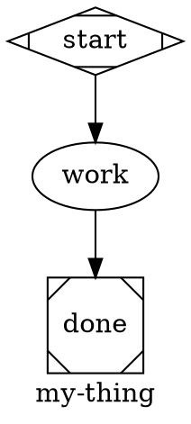
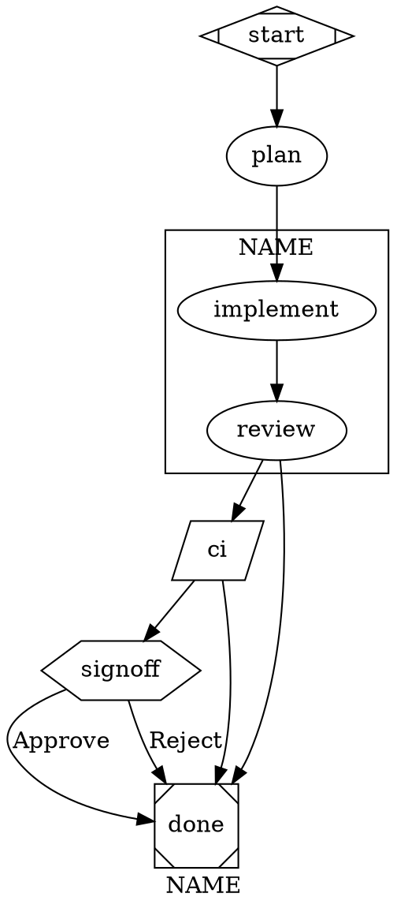

# swarm-author — pattern-first workflow authoring

A workflow is a small DAG that wires LLM calls, tools, waits, and reducers into a deterministic pipeline. Reach for one when:

- the job has 2+ distinct steps with different concerns or different tool needs
- you want backtracking on a quality gate (review rejects → re-implement)
- you want bounded concurrent dispatch (multi-lens review, multi-source research) — handled inside a codergen via the `agent` tool, not as a graph shape
- you need an explicit HITL pause point

Reach for a **single codergen node** (no graph at all) when:

- subtasks aren't known upfront and the model needs to choose them at runtime
- the task is one tool-use loop with a clear bound
- the work is exploratory; the shape isn't worth pinning yet

When in doubt, start with one node. Promote to a graph when you find yourself encoding the graph in prose.

Authoritative references: `docs/SPEC.md` §3 (primitives) + §4 (validation), `docs/ARCHITECTURE.md` §3 (event taxonomy). Validator codes: `references/validator-codes.md`. Retry-policy presets, model stylesheets, subgraphs: `references/advanced-attrs.md`.

---

## 1. Patterns — pick before you draw

Eight patterns cover ~all reasonable workflows. Names from Anthropic's "Building Effective Agents." Pick before you start drawing; the shape follows.

### Augmented LLM

One codergen node with a thoughtful tool pool. The whole "agent loop" lives inside that one node's tool-use cycle, bounded by `max_cost_usd` / `max_ms`. Use when subtasks aren't known upfront or the shape isn't worth pinning.

Reference: `orchestrate.dot`, `merge.dot`.

### Prompt chaining

Linear sequence: `A → B → C`. Each step feeds the next. Add an `outcome=fail` edge to bail early.

Reference: `ci-gate.dot` (pure tool chain), `analyze.dot`, `structural-drift.dot`.

### Routing

A node declares `routes="a,b,c"` and the codergen exits via `route({name:"billing"})`. Edges carry `route=<name>` to wire each branch:

```dot
classify [routes="billing,technical,fallback"]
classify -> billing   [route=billing]
classify -> technical [route=technical]
classify -> fallback  [route=fallback]
```

Non-routing nodes use `outcome=success` / `outcome=fail` edges (unannotated edges default to `outcome=success`).

### Orchestrator-workers

Single codergen orchestrator with `agent` in `allowed_tools`. The model decides how many sub-agents to spawn and what they do. Use when decomposition is dynamic.

Reference: `orchestrate.dot`, `doc-sync.dot::audit`, `narrative-drift.dot::audit`.

### Evaluator-optimizer

A node generates, the next node judges, and rejection retargets back to the generator. Encoded with `goal_gate=true` + `retry_target=` on the judge. The dominant pattern in our daily drivers.

Reference: `change.dot::review`, `feature.dot::review`, `fix-bug.dot::reproduce`, `narrative-drift.dot::review`, `structural-drift.dot::review`, `rollup.dot::verify`, `doc-sync.dot::review`.

### Autonomous agent

A single fat codergen with a broad tool pool, high bounds, and prose-encoded judgment. Use sparingly — usually a sign the workflow should be decomposed.

Reference: `merge.dot` (the heaviest current case).

### Choosing

1. **One step or many?** One → augmented LLM. Many → continue.
2. **Subtasks known upfront?** No → orchestrator-workers (concurrent dispatch via the `agent` tool — see `review.dot`). Yes → continue.
3. **Sequential or backtracking?** Sequential → chaining. Backtracking → evaluator-optimizer.
4. **Need branching by input?** Yes → routing.

Pick before drawing. Topology follows the pattern, not the other way around.

---

## 2. Workflow location, naming, resolution

Workflows live in two places, resolved in this order:

- `~/.swarm/workflows/` — global, reachable from any project cwd
- `<project>/.swarm/workflows/` — project-local

`swarm run my-thing` resolves the bare name. Validate first: `bun run swarm validate path/to/my-thing.dot`. Fix every error; take warnings seriously.

---

## 3. The two input channels

A node's input comes from one of two places. Pick consciously per node.

### Shared thread + fidelity (continuity)

Two nodes with the same `thread_id="…"` share an LLM conversation. The downstream node sees the upstream's reply as a regular assistant message in its context — no substitution, no copy-paste. The data is naturally present.

The downstream node controls how much of that conversation it sees via `fidelity=`:

| Mode | Meaning |
|---|---|
| `full` | The complete prior transcript. Default for evaluators / reviewers that need every turn. |
| `compact` | Compact replay format (default for most nodes). Cheaper than full; tool result content is preserved. |
| `truncate` | Headers + tail only. |
| `summary:low\|medium\|high` | A summariser-generated narrative tail in place of the older turns. Use when the thread is long enough that fidelity matters more than verbatim recall. |

Idiomatic uses:

- `implement` + `review` share `dev` — the reviewer judges from the conversation, with `fidelity=full` so it sees every diff turn. The implementer's `PLAN_REALISED` block sits in the thread as the last assistant message.
- `collect` + `audit` + `review` share `audit` — the collector dumps a deterministic JSON snapshot via `bash`; the analyser reads it from the thread; a goal-gate review retargets back to the analyser without re-running the script.

**Split heavy collectors into their own node.** When the first step runs a data-gathering script whose output is large (a `bun .swarm/scripts/foo/collect.ts` dumping JSON), make `collect` a dedicated codergen node with `allowed_tools = "bash"` and the same `thread_id` as the analyser. Two payoffs:

- **Retries don't repay the collector.** When a downstream goal-gate retargets back to the analyser, only the analyser re-runs — `collect` stays put. Without the split, the collector runs every retry and re-dumps the same JSON into the thread, multiplying tokens.
- **The thread carries the JSON.** The bash tool result lives in the shared thread; the analyser sees it under `fidelity=compact` (tool-result content is preserved) without any substitution. Reference the snapshot by name in the analyser prompt ("the collector snapshot contains …"), not by where it lives ("the prior turn", "$collect.output").

Keep the collect node's prompt minimal — run the script, `abort` on non-zero exit, otherwise reply `collected`. It does almost nothing; pin it to your cheapest tier via an id-selector in the stylesheet (`#collect { llm_model: …; }`). Don't ask it to summarise: the analyser reasons over the JSON itself.

Reference: `narrative-drift.dot`, `structural-drift.dot`.

### Environment re-derivation

Some nodes don't need an upstream artifact at all — they derive everything from environment (git, fs, an external API, a script via `bash`). Make this explicit in the prompt ("Fresh thread — read state via git" or "Run `bun .swarm/scripts/foo/collect.ts` via the bash tool and read its JSON output"). Examples: `commit` everywhere, `merge.dot`'s preflight, `ci` tool nodes, the single-codergen workflows under `.swarm/workflows/` that wrap a collector script.

When the source of truth is the environment, re-derive. It's cheaper than threading and harder to get wrong.

### Prompt substitution

Exactly one token expands in node `prompt` and `tool_command` strings: `$ARGUMENTS` — the run's `--input` (CLI positional or `POST /runs` body). Cross-node data transfer is **not** a substitution surface; use a shared thread + fidelity.

---

## 4. The shape vocabulary

Each node has a Graphviz shape; the shape picks the handler. Explicit `type="<handler>"` overrides (W012 warns on divergence; E016 rejects unknown handler names).

| Shape | Handler | What it does | Required attrs |
|---|---|---|---|
| `Mdiamond` | `start` | Lifecycle marker. Exactly one per graph. | — |
| `Msquare` | `exit` | Lifecycle marker. At least one. | — |
| `box` (default) | `codergen` | One LLM turn with tools. | `prompt=` |
| `hexagon` (alias `kind=human`) | `human` | Pauses with `fact.run_paused_human`. | `text=`, `routes=` |
| `parallelogram` | `tool` | Deterministic shell step. | `tool_command=` |

Concurrent dispatch lives inside a codergen via the `agent` tool, not as a graph shape (see Orchestrator-workers under §1).

Loops and waits aren't primitives. Loops are backward conditional edges (§8). Waits are `kind=human` nodes (DOT alias: `shape=hexagon`).

### Minimal skeleton



This parses, validates, and runs. Build up from here.

---

## 5. Node attributes (codergen)

Common attrs, in decreasing order of how often you'll touch them:

| Attribute | Type | Why |
|---|---|---|
| `prompt` | string | The user-message content. |
| `allowed_tools` | string[] (CSV) | Whitelist. If absent, unconstrained — usually wrong; name them. |
| `llm_model` | string | Provider-native model id. Must be registered (§11). |
| `llm_provider` | string | Provider key. Defaults to daemon default. |
| `thread_id` | string | Shares the LLM thread across nodes with the same id (§3). |
| `context_files` | string[] (CSV) | Files prepended as `<project-conventions>` blocks. |
| `max_retries` | int | Cap on backward-edge loops targeting this node (§8). |
| `reasoning_effort` | `low|medium|high` | Forwarded to extended-thinking providers. |
| `system_prompt` | string | Override the global system prompt. |
| `skills` | string[] (CSV) | Scope `<available_skills>` to this list. |
| `skills_disabled` | bool | Drop the skills catalog from this node's system prompt. |

> **Anti-pattern:** bare `model=` / `provider=` are silently ignored (W011). Use `llm_model=` / `llm_provider=`.

Quote DOT-special values: `prompt = "with, commas"`. String arrays are comma-separated strings: `allowed_tools = "read, write, edit, bash"`.

---

## 6. Tool nodes (parallelogram)

**Side-effect-only.** Deterministic shell steps. Exit 0 → `outcome=success`; non-zero → `outcome=fail`. The exit code is the entire user-visible result — tool nodes do **not** feed data forward to downstream nodes. Stdout/stderr are captured as artifacts (keys `<nodeId>:stdout`, `<nodeId>:stderr`) for debugging / replay.

```dot
ci   [shape=parallelogram, tool_command="bun run ci", max_retries=5]
lint [shape=parallelogram, tool_command="bun run lint"]
```

Use tool nodes for CI gates, deploys, idempotent side-effect commands, anything whose value is "did it succeed?". `$ARGUMENTS` substitutes (POSIX-quoted); no other substitution.

**Don't use tool nodes to gather data and feed it to a downstream codergen.** If a workflow needs to run a script and reason about its output, put the script invocation inside a codergen's `bash` tool — the codergen reads the script's stdout in its own context. A `collect → analyze` chain (tool → codergen) is an anti-pattern; collapse it to one codergen with `allowed_tools = "bash, read"` that runs `bun .swarm/scripts/foo/collect.ts` itself.

E008 rejects empty `tool_command`.

---

## 7. Edges and routing

Edge selection uses a two-case algorithm (SPEC §3.6):

- **Route case** — source declares `routes="a,b,c"`: match the edge whose `route=` equals the chosen route.
- **Outcome case** — all other nodes: match the edge whose `outcome=` equals the handler's outcome (`success` | `fail`). Unannotated edges default to `outcome=success`.

```dot
verify -> commit [outcome=success]
verify -> done   [outcome=fail]
```

For human-checkpoint nodes, declare `routes=` on the node and `route=` on edges (see §14):

```dot
signoff [kind=human, routes="approve,revise"]
signoff -> publish [route=approve, label="Approve"]
signoff -> draft   [route=revise,  label="Revise"]
```

---

## 8. Loops — backward conditional edges

No `loop` primitive. A loop is an edge that points backward on fail, bounded by `max_retries` on the target:

```dot
verify [prompt = "…", max_retries = 3]
verify -> verify [outcome=fail]
verify -> commit
```

`max_retries=3` allows up to 3 backward firings before the runtime halts with `reason=max_retries_exceeded`. Counting resets when re-entered from a different source.

For non-mechanical rejects (review-after-implement), prefer goal-gate retargets (§9) — the engine retargets automatically.

---

## 9. Goal gates (evaluator-optimizer)

A **goal gate** must succeed before the pipeline exits. Mark with `goal_gate=true`. When the run reaches a terminal, the engine checks every visited gate's outcome — if any is non-success, it retargets to `retry_target` instead of completing.

Retarget chain (SPEC §3.4), priority order:

1. failed gate's `retry_target`
2. failed gate's `fallback_retry_target`
3. graph-level `retry_target`
4. graph-level `fallback_retry_target`
5. halt with `fact.run_halted { reason: "goal_gate_unsatisfied" }`

Bounded by `max_goal_gate_retries` (graph attr, default 3).

```dot
graph [ retry_target = "implement", max_goal_gate_retries = 2 ]

review [
  prompt       = "Judge the diff. APPROVE, or call `abort` with reason `REJECT: …`."
  goal_gate    = true
  retry_target = "implement"
]

review -> done   [condition="outcome=fail"]
review -> verify
```

REJECT routes via the fail edge to `done`; the goal-gate enforcement at `done` sees `review` unsatisfied and retargets to `implement`.

**`max_retries` vs `max_goal_gate_retries`.** `max_retries` is *handler*-level (retry the same node N times on RETRY within one pass). Goal-gate retargets are *workflow*-level (jump backwards and re-run upstream nodes). A node can use both.

W007 fires on `goal_gate=true` with no retarget at any level.

---

## 11. Models, providers, validation

`POST /workflows` validates models at registration. Bad `model=` fails with `code="model_unresolved"` listing offenders — before enqueue.

Rules of thumb:

- `claude-sonnet-4-6` for mid-tier nodes (implement, verify, commit, merge). Fast, cheap, good enough.
- `claude-opus-4-7` for `plan` / `review` / heavy synthesis. Reasoning matters here.
- Tool nodes don't take `model=`.
- Unset = daemon default. Fine for drafts; explicit pins make cost predictable.

```sh
bun run swarm providers ls
bun run swarm providers test anthropic claude-sonnet-4-6
```

Graph-wide model defaults via `model_stylesheet` (CSS-like rules per shape/class/id): see `references/advanced-attrs.md`.

---

## 12. context_files

Comma-separated paths relative to the project root. Contents prepend to the system prompt as `<project-conventions>` blocks.

`context_files = "AGENTS.md"` is the common case — give the agent the rules before asking it to write code.

Don't stuff `docs/*.md` in wholesale; the system prompt has a 4KB cap and evictions degrade signal. One file with hard constraints beats three with general background.

---

## 13. Prompts that behave

### Authoritative task

```
Task (authoritative, do not substitute): $ARGUMENTS.
If $ARGUMENTS is empty, names nothing specific, or the target is blocked,
call the `abort` tool with reason `missing or blocked target`. Do NOT retarget silently.
```

### Abort tool

A node that decides the run can't proceed calls the built-in `abort` tool with a one-sentence `reason`. The runtime records `outcome=fail`, writes `fact.node_aborted`, and the run halts unless a downstream edge routes on `outcome=fail`. `abort` is force-included on every codergen node — even under `allowed_tools=""` — so node prompts never need to whitelist it.

```
If the task needs more than the workflow can handle (multi-package refactor, contract change),
call `abort` with reason `task too large, split into <suggested>: <reason>`.
```

### Tool whitelist

Always name the tools:

```
allowed_tools = "read, write, edit, bash"   # implement/verify
allowed_tools = "read, bash"                # plan/review (read-only)
allowed_tools = "read"                      # pure review
allowed_tools = "write"                     # summary-only writer
allowed_tools = "read, grep, find, ls"      # survey
```

`grep` / `find` / `ls` are native walkers (no shell spawn) so they work even when `bash` is denied.

### Tight prompts — no runtime leakage

Two rules:

**1. Cut fluff.** Goal + hard constraints + terminator (if any). Drop tool-usage walkthroughs, motivational framing, repeated warnings. Halve first; restore only what proves necessary.

**2. Don't leak runtime/graph plumbing into prompt text.** The LLM doesn't need to know about threads, turns, node ids, or substitution mechanics — that's the runtime's concern. If a shared thread carries upstream data, describe the task as if the data is naturally present:

```
✅ "Judge the diff against the implementer's PLAN_REALISED block and `git diff HEAD`."
❌ "The previous turn in this shared `dev` thread (the implement node) ended in a PLAN_REALISED
   block — your context has it verbatim. Compare against `git diff HEAD`."
```

Reference the *artifact* (PLAN_REALISED block, drift table, ground-truth report) — content the LLM can name. Don't reference *how* it got there.

`change.dot::plan` is ~150 words — reasonable upper end. Over 300 words: split or move rules to `context_files`.

---

## 14. Human nodes (operator gates)

A human node pauses and asks the operator to pick one of a closed set of routes. Declare it with `kind=human` (canonical) plus `text=` for the prompt and `routes=` for the closed enum of route names; the DOT alias `shape=hexagon` lowers to the same node kind. The `fact.run_paused_human` payload carries `text` + `routes: string[]`; the web UI renders one button per route. The operator resumes with `POST /runs/:id/human { route, note? }`; the server validates `route` against the declared enum (400 on off-list), the handler re-checks as defense-in-depth, and the executor fires the outgoing edge whose `route=` attribute matches.

```dot
signoff [
  shape  = hexagon
  kind   = human
  text   = "Drift report ready. Choose how to proceed."
  routes = "apply,output_only,reject"
]

signoff -> apply [route=apply,       label="Apply edits"]
signoff -> done  [route=output_only, label="Output only — preserve report"]
signoff -> done  [route=reject]
```

**Button label precedence.** The button text is the outgoing edge's `label=` if set, else `humanize(route)` (`output_only` → "Output Only"). Per D6 in `docs/proposals/llm-routing.md`, edge `label=` is pure UX — it never participates in routing. Two edges that share a target (e.g. both `done` in the example above) stay distinct because they carry different `route=` values; the engine's edge-selection Step-0 (route) case picks the right edge.

**Validator rules.** Every declared route must have exactly one outgoing edge with the matching `route=` (E021); `kind=human` requires `routes=` (E022); `goal_gate=true` and `routes=` are mutually exclusive (E023); two edges from the same source can't share a `route=` value (E024).

Keep `text` to one sentence + the route set. For free-text gates, omit `routes=` and let a downstream codergen read the operator's input through `intent.steering_requested` instead.

See `swarm-run` §5 for resume mechanics.

---

## 15. Graph-level attrs

```dot
graph [
  goal                  = "one-sentence purpose"
  label                 = "my-thing"
  default_max_retries   = 2
  default_retry_policy  = "standard"
  retry_target          = "implement"
  fallback_retry_target = ""
  max_goal_gate_retries = 2
  model_stylesheet      = "* { … }"
  budget_usd            = 5.00
  budget_tokens         = 200000
  budget_policy         = "stop"
]
```

- `goal` — keep short. Summarisers read this when deciding what matters.
- `default_*` cascade into nodes unless overridden.
- `budget_*` — `budget-policy.ts` evaluates `cumulative >= ceiling` at every turn boundary. `budget_policy="stop"` halts; `budget_policy="pause"` emits `fact.run_paused{reason:"budget"}`; `budget_policy="warn"` emits events without halting. Same semantics for node-level `max_cost_usd` / `max_tokens`.
- `max_ms` / `timeout` — per-node wall-clock ceiling. `max_ms=0` disables. Cost/token bounds are the real ceiling for codergen; wall-clock is a runaway backstop.

For `retry_policy` presets, `model_stylesheet` selectors, subgraphs: `references/advanced-attrs.md`.

---

## 16. Validation

`bun run swarm validate path/to/my-thing.dot` is the fast feedback loop. Fix every error; take warnings seriously.

Common codes:

- **E004** — edge references a non-existent node id (typo).
- **E016** — `type=` names an unknown handler.
- **E017** — routing node has outgoing `outcome=` edge (use `route=` instead).
- **E018** — edge sets both `outcome=` and `route=`.
- **E019** — edge `route=X` but `X` not in source node's `routes=`.
- **E020** — routing node has unannotated outgoing edge (neither `route=` nor `outcome=`).
- **E021** — route value declared in `routes=` but no outgoing edge has `route=<value>`.
- **E022** — human node (`kind=human` / `shape=hexagon`) has no `routes=`.
- **E023** — node combines `goal_gate=true` and `routes=` (mutually exclusive).
- **E024** — two edges from the same source share the same `outcome=` or `route=` value.
- **E025** — explicit `kind=` contradicts the shape's `SHAPE_TO_KIND` mapping.
- **E026** — `text=` on a non-human node.
- **W007** — `goal_gate=true` with no retarget chain.
- **W011** — bare `model=` / `provider=` (use `llm_model=` / `llm_provider=`).
- **W013** — unrecognised attribute name (typo source).

Full table: `references/validator-codes.md`.

---

## 17. Smoke-test recipe

```sh
bun run swarm validate path/to/my-thing.dot

# Dry-enqueue with a cheap model.
bun run swarm run my-thing --input="a realistic sample task"

# Watch. Expect fact.run_started → fact.node_started (per node)
# → fact.node_completed → … → terminal.
```

Run twice if you have the budget — once cold, once with prior artifacts cleared. Prompts that only work the second time are a trap.

---

## 18. Anti-patterns

- **Don't write a `loop` node.** Backward conditional edges + `max_retries`. Three nodes forming a loop usually want one node + a self-edge.
- **Don't pack two jobs into one node.** One prompt, one thread, one model, one tool pool.
- **Don't leave `model=` unset in shipped workflows.** Daemon default is fine for drafts; explicit pins make cost predictable across machines.
- **Don't `context_files = "docs/SPEC.md, docs/ARCHITECTURE.md, README.md"`.** Blows the event payload cap. One file with hard constraints, usually `AGENTS.md`.
- **Don't re-invent the `abort` tool.** Force-included on every codergen node; downstream edges route on `outcome=fail`.
- **Don't conditionally route on `outcome=error`.** States are `success` and `fail`. `fact.run_halted { reason:"error" }` is terminal, not edge-eligible.
- **Don't edit a workflow mid-run.** `workflow_sha` is pinned at enqueue (SPEC §5). Edits apply to future runs.
- **Don't use `condition=` on edges.** The condition DSL has been removed. Use `outcome=success` / `outcome=fail` for non-routing nodes, and `route=<name>` for routing nodes (`routes=` declared on the source).
- **Don't pair `goal_gate=true` with no retarget.** W007.
- **Don't use a tool node to gather data for a downstream codergen.** Tool nodes are side-effect-only. If you need to run a deterministic script and reason about its output, call the script from inside a codergen's `bash` tool — the codergen reads stdout in its own context. The `collect → analyze` (tool → codergen) chain is the anti-pattern that motivated retiring `$<node>.output` substitution.
- **Don't run a heavy collector inside the same node that's a goal-gate retarget target.** Each retarget re-runs the collector and re-dumps its (often large) JSON into the thread, multiplying tokens for no information gain. Split `collect` into its own codergen node sharing `thread_id` with the analyser — the bash tool result stays in the thread across retries while only the analyser re-runs. Reference: `narrative-drift.dot`, `structural-drift.dot`.
- **Don't leak runtime plumbing into prompts.** No "the previous turn in this shared `dev` thread …", "your context contains …", "in a SINGLE assistant message" — the LLM doesn't need to model threads, turn boundaries, or message boundaries. Describe the task and reference the artifact by name ("the PLAN_REALISED block", "the drift table", "the collector snapshot"); the LLM already sees its own context.

---

## Cheat sheet



```sh
bun run swarm validate path/to/my-thing.dot
bun run swarm run      my-thing --input="…"
```

When a workflow misbehaves: switch to `swarm-debug` for post-mortem. When a run needs steering or pausing mid-flight: `swarm-run`.
