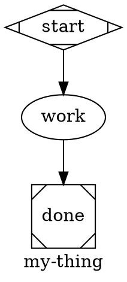
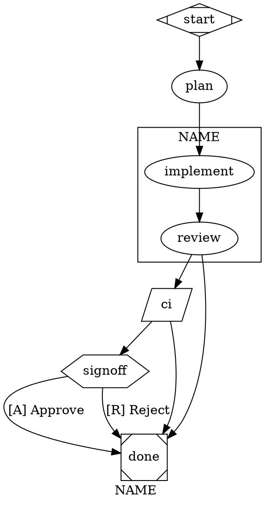

# swarm-author — pattern-first workflow authoring

A workflow is a small DAG that wires LLM calls, tools, waits, and reducers into a deterministic pipeline. Reach for one when:

- the job has 2+ distinct steps with different concerns or different tool needs
- you want backtracking on a quality gate (review rejects → re-implement)
- you want bounded parallelism (multi-lens review, multi-source research)
- you need an explicit HITL pause point

Reach for a **single codergen node** (no graph at all) when:

- subtasks aren't known upfront and the model needs to choose them at runtime
- the task is one tool-use loop with a clear bound
- the work is exploratory; the shape isn't worth pinning yet

When in doubt, start with one node. Promote to a graph when you find yourself encoding the graph in prose.

Authoritative references: `docs/SPEC.md` §3 (primitives) + §4 (validation), `docs/ARCHITECTURE.md` §3 (event taxonomy), `docs/graph/` (the typed model the runtime is moving toward). Validator codes: `references/validator-codes.md`. Retry-policy presets, model stylesheets, subgraphs: `references/advanced-attrs.md`.

---

## 1. Patterns — pick before you draw

Eight patterns cover ~all reasonable workflows. Names from Anthropic's "Building Effective Agents." Pick before you start drawing; the shape follows.

### Augmented LLM

One codergen node with a thoughtful tool pool. The whole "agent loop" lives inside that one node's tool-use cycle, bounded by `max_cost_usd` / `max_ms`. Use when subtasks aren't known upfront or the shape isn't worth pinning.

Reference: `orchestrate.dot`, `merge.dot`.

### Prompt chaining

Linear sequence: `A → B → C`. Each step feeds the next. Add an `outcome=fail` edge to bail early.

Reference: `ci-gate.dot` (pure tool chain), `analyze.dot`, `structural-drift.dot`.

### Routing

Classify upstream, then conditional edges fan to specialists.

```dot
classify -> billing   [condition="context.kind=billing"]
classify -> technical [condition="context.kind=technical"]
classify -> fallback
```

Not currently represented in the catalog — `change.dot` + `feature.dot` would collapse into one routed graph cleanly.

### Parallel — sectioning

N concurrent branches, each examining a different concern, joined by a reducer. `component → branches → tripleoctagon`.

Reference: `review.dot` (4 lenses → synthesised report).

### Parallel — voting

Same task N times, aggregate. Same shape as sectioning, branches identical, reducer is a vote / median / majority. Useful when you want variance and majority-rules confidence on a high-stakes call.

Not currently in the catalog (gap). Supported by the same primitives.

### Orchestrator-workers

Single codergen orchestrator with `agent` in `allowed_tools`. The model decides how many sub-agents to spawn and what they do. Use when decomposition is dynamic.

Reference: `orchestrate.dot`, `doc-sync.dot::audit`, `narrative-drift.dot::audit`.

### Evaluator-optimizer

A node generates, the next node judges, and rejection retargets back to the generator. Encoded with `goal_gate=true` + `retry_target=` on the judge. The dominant pattern in our daily drivers.

Reference: `change.dot::review`, `feature.dot::review`, `fix-bug.dot::reproduce`, `narrative-drift.dot::review`, `structural-drift.dot::review`, `rollup.dot::verify`, `doc-sync.dot::review`.

### Autonomous agent

A single fat codergen with a broad tool pool, high bounds, and prose-encoded judgment. Use sparingly — usually a sign the workflow should be decomposed.

Reference: `merge.dot` (the heaviest current case).

### Choosing

1. **One step or many?** One → augmented LLM. Many → continue.
2. **Subtasks known upfront?** No → orchestrator-workers. Yes → continue.
3. **Concurrent or sequential?** Concurrent + different concerns → sectioning. Concurrent + same task → voting. Sequential → chaining.
4. **Need backtracking?** Yes → evaluator-optimizer. No → straight chain.
5. **Need branching by input?** Yes → routing.

Pick before drawing. Topology follows the pattern, not the other way around.

---

## 2. Workflow location, naming, resolution

Workflows live in two places, resolved in this order:

- `~/.swarm/workflows/` — global, reachable from any project cwd
- `<project>/.swarm/workflows/` — project-local

`swarm run my-thing` resolves the bare name. Validate first: `bun run swarm validate path/to/my-thing.dot`. Fix every error; take warnings seriously.

---

## 3. The three input channels

A node's input comes from one of three places. Pick consciously per node; don't combine them when you mean only one.

### Shared thread (continuity)

Two nodes with the same `thread_id="…"` share an LLM conversation. The downstream node sees the upstream's reply as a regular assistant message in its context — no substitution needed; the data is naturally present.

Idiomatic uses:

- `implement` + `review` share `dev` — the reviewer judges from the conversation, not from re-pasted output.
- `audit` + `diff` share `audit` — diff reads the audit report from context.

### Substitution (data hand-off across thread boundaries)

When the producer doesn't share a thread with the consumer (or the producer is a tool, which doesn't participate in threads), substitute upstream output explicitly:

| Token | Meaning |
|---|---|
| `$ARGUMENTS` | CLI positional input (or `--input`). |
| `$<nodeId>.output` | Output of a prior node — codergen last turn or tool stdout. Used when no shared thread carries the data: typically tool→codergen or fan-out→reducer. |
| `$<nodeId>.output.<path>` | JSON path into the node's structured output (`data`), if present. |
| `$<nodeId>.stderr` | Tool node stderr channel. Empty for codergen. |
| `$goal` | The graph's `goal` attribute. |

> **Prefer shared threads over substitution when both nodes are codergens that benefit from continuity.** Substitution is correct when threads don't apply (tool stdout, fan-out reducers) but redundant — a verbatim duplicate — when a thread already carries the message. In the typed model under `docs/graph/`, edge transforms replace substitution entirely; this is the transitional knob.

E005 flags `$<id>.output` when `<id>` isn't a known node id.

### Environment re-derivation

Some nodes don't need an upstream artifact at all — they derive everything from environment (git, fs, an external API). Make this explicit in the prompt ("Fresh thread — read state via git"). Examples: `commit` everywhere, `merge.dot`'s preflight, `ci` tool nodes.

When the source of truth is the environment, re-derive. It's cheaper than threading and harder to get wrong.

---

## 4. The shape vocabulary

Each node has a Graphviz shape; the shape picks the handler. Explicit `type="<handler>"` overrides (W012 warns on divergence; E016 rejects unknown handler names).

| Shape | Handler | What it does | Required attrs |
|---|---|---|---|
| `Mdiamond` | `start` | Lifecycle marker. Exactly one per graph. | — |
| `Msquare` | `exit` | Lifecycle marker. At least one. | — |
| `box` (default) | `codergen` | One LLM turn with tools. | `prompt=` |
| `diamond` | `conditional` | Pure edge routing. No LLM, no prompt. | — |
| `hexagon` | `wait.human` | Pauses with `fact.run_paused_hitl`. | `prompt=` |
| `parallelogram` | `tool` | Deterministic shell step. | `tool_command=` |
| `component` | `parallel` | Fan-out branch spawner. | — |
| `tripleoctagon` | `parallel.fan_in` | Joins branches. | — |

Loops and waits aren't primitives. Loops are backward conditional edges (§8). Waits are `wait.human` nodes.

### Minimal skeleton



This parses, validates, and runs. Build up from here.

---

## 5. Node attributes (codergen)

Common attrs, in decreasing order of how often you'll touch them:

| Attribute | Type | Why |
|---|---|---|
| `prompt` | string | The user-message content. |
| `allowed_tools` | string[] (CSV) | Whitelist. If absent, unconstrained — usually wrong; name them. |
| `llm_model` | string | Provider-native model id. Must be registered (§11). |
| `llm_provider` | string | Provider key. Defaults to daemon default. |
| `thread_id` | string | Shares the LLM thread across nodes with the same id (§3). |
| `context_files` | string[] (CSV) | Files prepended as `<project-conventions>` blocks. |
| `max_retries` | int | Cap on backward-edge loops targeting this node (§8). |
| `reasoning_effort` | `low|medium|high` | Forwarded to extended-thinking providers. |
| `system_prompt` | string | Override the global system prompt. |
| `skills` | string[] (CSV) | Scope `<available_skills>` to this list. |
| `skills_disabled` | bool | Drop the skills catalog from this node's system prompt. |

> **Anti-pattern:** bare `model=` / `provider=` are silently ignored (W011). Use `llm_model=` / `llm_provider=`.

Quote DOT-special values: `prompt = "with, commas"`. String arrays are comma-separated strings: `allowed_tools = "read, write, edit, bash"`.

---

## 6. Tool nodes (parallelogram)

Deterministic shell steps. Exit 0 → `outcome=success`; non-zero → `outcome=fail`. stdout/stderr capture as artifacts (keys `<nodeId>:stdout`, `<nodeId>:stderr`).

```dot
lint [shape=parallelogram, tool_command="bun run lint"]
```

Substitution applies to `tool_command`. Use tool nodes for CI gates, environment probes, idempotent side-effect commands. Don't use them for LLM prompts that happen to shell out — that's the codergen `bash` tool.

E008 rejects empty `tool_command`.

---

## 7. Edges and conditions

An edge with no `condition=` fires unconditionally when the source completes. Edges with conditions evaluate in source order; first match wins. Unconditional edges run only if nothing matched.

Condition grammar:

```
expr := term ("&&" term)*
term := path op value
op   := "=" | "!="
path := "outcome" | "context.<key>" | "context.<key>.<sub>" | …
```

- `outcome=success | fail` — set by the handler. Codergen `fail` when the agent calls `abort`; tool from exit code.
- `context.foo=bar` — reads run context KV.
- `&&` conjunction only. No `||` — use a second edge.

```dot
verify -> commit [condition="outcome=success"]
verify -> done   [condition="outcome=fail"]

signoff -> publish [label="[A] Approve"]
signoff -> draft   [label="[R] Revise"]

gate -> escalate [condition="outcome=fail && context.severity=high"]
```

W003 warns when a node has only conditional edges and no `outcome=fail` catch-all.

---

## 8. Loops — backward conditional edges

No `loop` primitive. A loop is an edge that points backward with a condition, bounded by `max_retries` on the target:

```dot
verify [prompt = "…", max_retries = 3]
verify -> verify [condition="outcome=fail"]
verify -> commit [condition="outcome=success"]
```

`max_retries=3` allows up to 3 backward firings before the runtime halts with `reason=max_retries_exceeded`. Counting resets when re-entered from a different source.

For non-mechanical rejects (review-after-implement), prefer goal-gate retargets (§9) — the engine retargets automatically.

---

## 9. Goal gates (evaluator-optimizer)

A **goal gate** must succeed before the pipeline exits. Mark with `goal_gate=true`. When the run reaches a terminal, the engine checks every visited gate's outcome — if any is non-success, it retargets to `retry_target` instead of completing.

Retarget chain (SPEC §3.4), priority order:

1. failed gate's `retry_target`
2. failed gate's `fallback_retry_target`
3. graph-level `retry_target`
4. graph-level `fallback_retry_target`
5. halt with `fact.run_halted { reason: "goal_gate_unsatisfied" }`

Bounded by `max_goal_gate_retries` (graph attr, default 3).

```dot
graph [ retry_target = "implement", max_goal_gate_retries = 2 ]

review [
  prompt       = "Judge the diff. APPROVE, or call `abort` with reason `REJECT: …`."
  goal_gate    = true
  retry_target = "implement"
]

review -> done   [condition="outcome=fail"]
review -> verify
```

REJECT routes via the fail edge to `done`; the goal-gate enforcement at `done` sees `review` unsatisfied and retargets to `implement`.

**`max_retries` vs `max_goal_gate_retries`.** `max_retries` is *handler*-level (retry the same node N times on RETRY within one pass). Goal-gate retargets are *workflow*-level (jump backwards and re-run upstream nodes). A node can use both.

W007 fires on `goal_gate=true` with no retarget at any level.

---

## 10. Parallel — sectioning and voting

`component`-shaped nodes fan out: each outgoing edge becomes a concurrent branch. Branches converge on a `tripleoctagon` (fan-in). The fan-in target is discovered structurally from edges.

### Sectioning — N concerns, one reducer

```dot
explore [shape=component, join_policy="wait_all"]

lens_correctness [class="lens", prompt = "find CORRECTNESS risks — one per line", allowed_tools = "read, bash"]
lens_style       [class="lens", prompt = "find STYLE regressions",                allowed_tools = "read, bash"]
lens_security    [class="lens", prompt = "find SECURITY concerns",                allowed_tools = "read, bash"]

collect [shape=tripleoctagon]

explore -> lens_correctness
explore -> lens_style
explore -> lens_security
lens_correctness -> collect
lens_style       -> collect
lens_security    -> collect
```

- `join_policy="wait_all"` (default) — fire when every branch completes.
- `join_policy="first_success"` — fire on first success; others abort.

### Voting — N runs of the same task

Same shape, branches identical, reducer aggregates. Useful when you want variance and majority-rules confidence. (No example currently in the catalog; same primitives.)

### Fan-in reducer kinds

`tripleoctagon` runs one of two reducers, picked by `prompt=` presence:

- **Heuristic (no `prompt=`)** — deterministic ranker over branch outcomes. Writes the winner's branchId to `fan_in.<id>.winner` in routing. Zero cost, replay-stable. Best for parallel voting / "pick the best outcome" patterns.
- **LLM synthesis (`prompt=` set)** — feeds every branch's `$<branchId>.output` text to the LLM and returns its reply verbatim as the fan-in node's `output` artifact. Downstream nodes read it as `$<fanInId>.output`. Best for "integrate four lenses into one review" patterns. Requires the daemon to have an LLM provider/model configured (the harness wires this automatically; the CI primitive needs `--llm-provider`/`--llm-model`).

See `review.dot`'s `collect` for the canonical LLM-synthesis fan-in. The synthesised document is sliced to ~4 KB by the codergen backend's `Outcome.notes` cap.

E007 catches structural fan-in problems. HITL inside a parallel branch is not supported in v1 — put HITL outside the fan-out.

---

## 11. Models, providers, validation

`POST /workflows` validates models at registration. Bad `model=` fails with `code="model_unresolved"` listing offenders — before enqueue.

Rules of thumb:

- `claude-sonnet-4-6` for mid-tier nodes (implement, verify, commit, merge). Fast, cheap, good enough.
- `claude-opus-4-7` for `plan` / `review` / heavy synthesis. Reasoning matters here.
- Tool nodes don't take `model=`.
- Unset = daemon default. Fine for drafts; explicit pins make cost predictable.

```sh
bun run swarm providers ls
bun run swarm providers test anthropic claude-sonnet-4-6
```

Graph-wide model defaults via `model_stylesheet` (CSS-like rules per shape/class/id): see `references/advanced-attrs.md`.

---

## 12. context_files

Comma-separated paths relative to the project root. Contents prepend to the system prompt as `<project-conventions>` blocks.

`context_files = "AGENTS.md"` is the common case — give the agent the rules before asking it to write code.

Don't stuff `docs/*.md` in wholesale; the system prompt has a 4KB cap and evictions degrade signal. One file with hard constraints beats three with general background.

---

## 13. Prompts that behave

### Authoritative task

```
Task (authoritative, do not substitute): $ARGUMENTS.
If $ARGUMENTS is empty, names nothing specific, or the target is blocked,
call the `abort` tool with reason `missing or blocked target`. Do NOT retarget silently.
```

### Abort tool

A node that decides the run can't proceed calls the built-in `abort` tool with a one-sentence `reason`. The runtime records `outcome=fail`, writes `fact.node_aborted`, and the run halts unless a downstream edge routes on `outcome=fail`. `abort` is force-included on every codergen node — even under `allowed_tools=""` — so node prompts never need to whitelist it.

```
If the task needs more than the workflow can handle (multi-package refactor, contract change),
call `abort` with reason `task too large, split into <suggested>: <reason>`.
```

### Tool whitelist

Always name the tools:

```
allowed_tools = "read, write, edit, bash"   # implement/verify
allowed_tools = "read, bash"                # plan/review (read-only)
allowed_tools = "read"                      # pure review
allowed_tools = "write"                     # summary-only writer
allowed_tools = "read, grep, find, ls"      # survey
```

`grep` / `find` / `ls` are native walkers (no shell spawn) so they work even when `bash` is denied.

### Tight prompts — no runtime leakage

Two rules:

**1. Cut fluff.** Goal + hard constraints + terminator (if any). Drop tool-usage walkthroughs, motivational framing, repeated warnings. Halve first; restore only what proves necessary.

**2. Don't leak runtime/graph plumbing into prompt text.** The LLM doesn't need to know about threads, turns, node ids, or substitution mechanics — that's the runtime's concern. If a shared thread carries upstream data, describe the task as if the data is naturally present:

```
✅ "Judge the diff against the implementer's PLAN_REALISED block and `git diff HEAD`."
❌ "The previous turn in this shared `dev` thread (the implement node) ended in a PLAN_REALISED
   block — your context has it verbatim. Compare against `git diff HEAD`."
```

Reference the *artifact* (PLAN_REALISED block, drift table, ground-truth report) — content the LLM can name. Don't reference *how* it got there.

`change.dot::plan` is ~150 words — reasonable upper end. Over 300 words: split or move rules to `context_files`.

---

## 14. wait.human (HITL nodes)

`hexagon`-shaped nodes pause and ask the operator a question. The `fact.run_paused_hitl` payload carries the node's `prompt` and edge labels as options. The operator resumes with `POST /runs/:id/hitl { selected, note? }`; the structured handler picks the outgoing edge whose label matches by accelerator key.

```dot
signoff [
  shape  = hexagon
  prompt = "Reviewers found issues. Approve to ship, or reject."
]

signoff -> publish [label="[A] Approve"]
signoff -> draft   [label="[R] Reject"]
```

Accelerator keys must be unique across the hexagon's outgoing edges (E010).

**Don't** put `condition="context.hitl.<nodeId>=…"` on hexagon edges — that's the legacy codergen-driven path; the structured handler doesn't write `context.hitl.*` for label-routed gates. W004 flags it.

Keep the prompt to one sentence + the option set the labels imply. For free-text gates, omit edge labels and let a downstream codergen read the operator's input.

See `swarm-run` §5 for resume mechanics.

---

## 15. Graph-level attrs

```dot
graph [
  goal                  = "one-sentence purpose"
  label                 = "my-thing"
  default_max_retries   = 2
  default_retry_policy  = "standard"
  retry_target          = "implement"
  fallback_retry_target = ""
  max_goal_gate_retries = 2
  model_stylesheet      = "* { … }"
  budget_usd            = 5.00
  budget_tokens         = 200000
  budget_policy         = "stop"
]
```

- `goal` — keep short. Summarisers read this when deciding what matters.
- `default_*` cascade into nodes unless overridden.
- `budget_*` — `budget-policy.ts` evaluates `cumulative >= ceiling` at every turn boundary. `budget_policy="stop"` halts; `budget_policy="pause"` emits `fact.run_paused{reason:"budget"}`; `budget_policy="warn"` emits events without halting. Same semantics for node-level `max_cost_usd` / `max_tokens`.
- `max_ms` / `timeout` — per-node wall-clock ceiling. `max_ms=0` disables. Cost/token bounds are the real ceiling for codergen; wall-clock is a runaway backstop.

For `retry_policy` presets, `model_stylesheet` selectors, subgraphs: `references/advanced-attrs.md`.

---

## 16. Validation

`bun run swarm validate path/to/my-thing.dot` is the fast feedback loop. Fix every error; take warnings seriously.

Common codes:

- **E004** — edge references a non-existent node id (typo).
- **E005** — `$<id>.output` references unknown node id.
- **E007** — `component` missing or pointing at wrong fan-in.
- **E016** — `type=` names an unknown handler.
- **W003** — only conditional edges, no `outcome=fail` catch-all.
- **W004** — hexagon edge using legacy `context.hitl.*`.
- **W007** — `goal_gate=true` with no retarget chain.
- **W011** — bare `model=` / `provider=` (use `llm_model=` / `llm_provider=`).
- **W013** — unrecognised attribute name (typo source).

Full table: `references/validator-codes.md`.

---

## 17. Smoke-test recipe

```sh
bun run swarm validate path/to/my-thing.dot

# Dry-enqueue with a cheap model.
bun run swarm run my-thing --input="a realistic sample task"

# Watch. Expect fact.run_started → fact.node_started (per node)
# → fact.node_completed → … → terminal.
```

Run twice if you have the budget — once cold, once with prior artifacts cleared. Prompts that only work the second time are a trap.

---

## 18. Anti-patterns

- **Don't write a `loop` node.** Backward conditional edges + `max_retries`. Three nodes forming a loop usually want one node + a self-edge.
- **Don't pack two jobs into one node.** One prompt, one thread, one model, one tool pool.
- **Don't leave `model=` unset in shipped workflows.** Daemon default is fine for drafts; explicit pins make cost predictable across machines.
- **Don't `context_files = "docs/SPEC.md, docs/ARCHITECTURE.md, README.md"`.** Blows the event payload cap. One file with hard constraints, usually `AGENTS.md`.
- **Don't re-invent the `abort` tool.** Force-included on every codergen node; downstream edges route on `outcome=fail`.
- **Don't conditionally route on `outcome=error`.** States are `success` and `fail`. `fact.run_halted { reason:"error" }` is terminal, not edge-eligible.
- **Don't edit a workflow mid-run.** `workflow_sha` is pinned at enqueue (SPEC §5). Edits apply to future runs.
- **Don't put HITL inside a parallel branch.** Not supported; coerces to fail.
- **Don't use legacy `context.hitl.<id>=…` on hexagon edges.** W004. Use `[K] Label`.
- **Don't pair `goal_gate=true` with no retarget.** W007.
- **Don't substitute `$<node>.output` when producer and consumer share a thread.** Redundant — the message is already in context. Substitution is correct for tool→codergen and fan-out→reducer; not for default data transfer between codergens.
- **Don't leak runtime plumbing into prompts.** No "the previous turn in this shared `dev` thread …" — the LLM doesn't need to model threads. Describe the task; reference the artifact.

---

## Cheat sheet



```sh
bun run swarm validate path/to/my-thing.dot
bun run swarm run      my-thing --input="…"
```

When a workflow misbehaves: switch to `swarm-debug` for post-mortem. When a run needs steering or pausing mid-flight: `swarm-run`.
