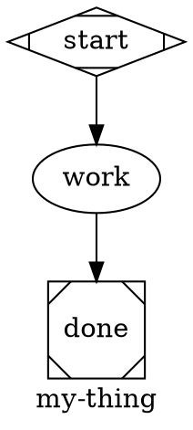
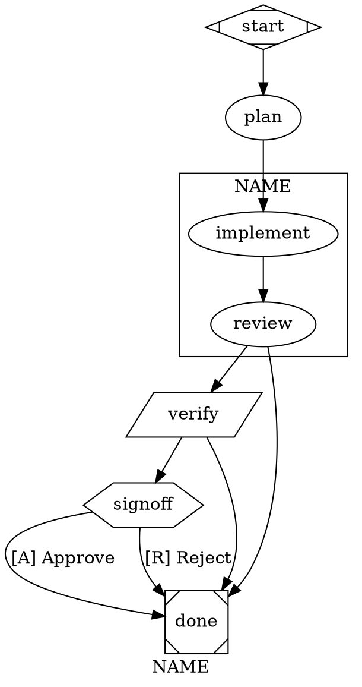

# swarm-author — writing DOT workflows that run

The goal is a small, legible `.dot` file that encodes a clear plan the runtime can execute deterministically. Start from a similar workflow, keep nodes few, let edges carry the control flow, and validate before you run.

Authoritative references: `docs/SPEC.md` §3 (primitives) + §4 (validation), `docs/ARCHITECTURE.md` §3 (event taxonomy) + §12.1 (declared-but-not-wired). Attribute grammar: `packages/core/src/types/graph.ts`. Validator: `packages/core/src/engine/validator.ts`.

For the validator code lookup table, see `references/validator-codes.md`. For retry-policy presets, model stylesheets, and subgraphs, see `references/advanced-attrs.md`.

---

## Fast path

1. **Find a template.** Workflows live in two places:
   - `~/.swarm/workflows/` (global, generic) — `change.dot` (daily driver: plan/implement/review/verify/commit), `fix-bug.dot` (reproduce → fix → verify), `merge.dot` (rebase + CAS-fast-forward).
   - `<project>/.swarm/workflows/` (local, project-internal) — e.g. this repo's `introspect.dot`, `ci-gate.dot`, `analyze.dot`, `showcase.dot`, `abort-test.dot`.
2. **Sketch the shape, not the prose.** Nodes + edges first. Name nodes for what they *do* (`plan`, `implement`, `verify`), not what they are (`step1`, `llm_call`). Edges carry flow. Conditional edges route on `outcome=success|fail` or `context.<key>=<val>`.
3. **Validate.** `bun run swarm validate path/to/my-thing.dot`. Fix every error; warnings are strong hints.
4. **Smoke-run** with a cheap model first (§9) before wiring to Opus / Sonnet.

`swarm run my-thing` resolves the bare name against `~/.swarm/workflows/my-thing.dot` first, then `<cwd>/.swarm/workflows/my-thing.dot`. Drop new global workflows in `~/.swarm/workflows/` so they're reachable from any cwd.

---

## 1. The shape vocabulary

Each node has a Graphviz shape; the shape picks the handler. An explicit `type="<handler>"` overrides the shape (attractor §2.6) — useful when you want the visual cue of one shape but the runtime of another. The validator warns on shape/type divergence (W012) and rejects unknown handler names (E016).

| Shape | Handler | What it does | Required attrs |
|---|---|---|---|
| `Mdiamond` | `start` | Lifecycle marker. Exactly one per graph. | — |
| `Msquare` | `exit` | Lifecycle marker. At least one. | — |
| `box` (default) | `codergen` | One LLM turn with tools. The default when no `shape=` is set. | `prompt=` |
| `diamond` | `conditional` | Pure edge-routing. No LLM, no prompt. Edge `condition=`s do the work. | — |
| `hexagon` | `wait.human` | Pauses with `fact.run_paused_hitl`. | `prompt=` (what to ask) |
| `parallelogram` | `tool` | Deterministic shell step. | `tool_command=` |
| `component` | `parallel` | Fan-out branch spawner. Outgoing edges are the branches. | — (optional `join_policy=`) |
| `tripleoctagon` | `parallel.fan_in` | Joins branches. Optional `prompt=` reduces branch outputs. | — |

Loops and "wait" are *not* primitives. Loops are backward conditional edges (§7). Waits are `wait.human` nodes. Don't look for a `loop` shape; it doesn't exist.

### Minimal skeleton



This parses, validates, and runs. Build up from here.

---

## 2. Node attributes (codergen)

`box`-shaped nodes are LLM calls. Common attrs, in decreasing order of how often you'll touch them:

| Attribute | Type | Why |
|---|---|---|
| `prompt` | string | The user-message content. Substitution applies (§4). |
| `allowed_tools` | string[] (CSV) | Whitelist. If absent, tools are unconstrained — usually wrong; name them. |
| `llm_model` | string | Provider-native model id (e.g. `claude-sonnet-4-6`, `gpt-5.2`). Must be registered (§10). |
| `llm_provider` | string | Provider key (e.g. `anthropic`, `openai`, `google`). Defaults to the daemon's default. |
| `thread_id` | string | Shares the LLM thread across nodes that set the same `thread_id` (§5). |
| `context_files` | string[] (CSV) | Files from the project root prepended to the system prompt as `<project-conventions>` blocks. `context_files = "AGENTS.md"` is the usual one. |
| `fidelity` | enum | `full | truncate | compact | summary:low | summary:medium | summary:high`. Default `compact`. |
| `max_retries` | int | Cap on backward-conditional-edge loops targeting this node (§7). |
| `reasoning_effort` | `low|medium|high` | Forwarded to providers that support it (Anthropic extended thinking, OpenAI o-series). |
| `system_prompt` | string | Override the backend's global system prompt. Useful for reviewer / planner subagents. |
| `skills` | string[] (CSV) | Scope `<available_skills>` to this list. Absent = all discovered. |
| `skills_disabled` | bool | Hard opt-out — no skills catalog in the system prompt for this node. |

> **Anti-pattern:** bare `model=` and `provider=` are silently ignored by the runtime and trigger validator W011 — always use `llm_model=` and `llm_provider=`.

Quote values with commas or spaces per DOT rules: `prompt = "with, commas, ok"`. String arrays are comma-separated inside a string: `allowed_tools = "read, write, edit, bash"`.

---

## 3. Tool nodes (parallelogram)

Deterministic shell steps. Exit 0 → `outcome=success`; non-zero → `outcome=fail`. stdout/stderr capture as artifacts (keys `<nodeId>:stdout`, `<nodeId>:stderr`).

```dot
lint [shape=parallelogram, tool_command="bun run lint"]
```

Substitution applies to `tool_command` (§4). Use tool nodes for CI gates, environment probes, idempotent side-effect commands. Don't use them for LLM prompts that happen to shell out — let the codergen node's `bash` tool do that.

E008 rejects a parallelogram with empty `tool_command`.

---

## 4. Substitution tokens

Applied to `prompt`, `tool_command`, and any string attr. Order is longest-prefix-match; shell-safe mode single-quotes values.

| Token | Meaning |
|---|---|
| `$ARGUMENTS` | CLI positional input (or `--input`). One of the few things the user controls per-run. |
| `$<nodeId>.output` | Raw text output of a prior node (codergen last turn's text, or tool stdout). |
| `$<nodeId>.output.<path>` | JSON-path dive into structured output; returns `""` if absent. |
| `${context.<key>}` | Read from run context KV. |
| `$goal` | The graph's `goal` attribute. |

That's the full set — see `packages/core/src/engine/substitution.ts`. Tokens like `$RUN_ID`, `$WORKTREE_PATH`, `$ARTIFACTS_DIR`, `$1`…`$9` are not implemented; they appear literally if you write them.

E005 flags `$<id>.output` when `<id>` isn't a node id — typos surface at parse time, not at run.

Reference an upstream node by *id*, not by `label`. `$implement.output` reads the `implement` node's output regardless of its label.

---

## 5. Thread-id (context between nodes)

Codergen nodes default to **fresh threads** — each LLM call is `priorMessages = []` + the prompt. Set `thread_id="something"` to share the message thread across nodes that declare the same thread id. Idiomatic uses:

- **`thread_id="dev"`** on `implement` + `verify` + (sometimes) `fix` — the verifier remembers what the implementer did.
- **No thread_id** on `plan`, `review`, `commit`, `merge` — each reads state via git, forming its own opinion. Fresh threads prevent context-poisoning from a flawed earlier turn.

Sharing a thread shares cost: every call sees all prior messages (modulo `fidelity=`). Use it where context *adds* value, not by default.

---

## 6. Edges and conditions

An edge with no `condition=` fires unconditionally when the source node completes. Edges with conditions evaluate in source order; first match wins. Unconditional edges run only if nothing matched.

Condition grammar (`packages/core/src/engine/condition.ts`):

```
expr := term ("&&" term)*
term := path op value
op   := "=" | "!="
path := "outcome" | "context.<key>" | "context.<key>.<sub>" | …
val  := STRING | NUMBER | IDENT | true | false | null
```

- `outcome=success | fail` — set by the handler. Codergen `outcome=fail` when the agent calls the `abort` tool; tool outcome from exit code.
- `context.foo=bar` — reads run context KV.
- `&&` conjunction only; no `||`. Split into two edges if you need disjunction.

```dot
# Branch on success, unconditional fallback.
verify -> commit [condition="outcome=success"]
verify -> done   [condition="outcome=fail"]

# HITL — structured, route by edge label accelerator (§12).
signoff -> publish [label="[A] Approve"]
signoff -> draft   [label="[R] Revise"]

# Conjunction.
gate -> escalate [condition="outcome=fail && context.severity=high"]
```

W003 warns when a node has only conditional edges and no `outcome=fail` catch-all — a flaky handler can silently terminate the run.

---

## 7. Loops (backward conditional edges)

There is no `loop` primitive. A loop is an edge that points backward with a condition, bounded by `max_retries` on the *target* node:

```dot
verify [prompt = "…", max_retries = 3]
verify -> verify [condition="outcome=fail"]
verify -> commit [condition="outcome=success"]
```

`max_retries=3` allows up to 3 backward-edge firings before the runtime halts with `reason=max_retries_exceeded`. Counting resets when re-entered from a *different* source.

Don't chain four nodes into a loop when a single `max_retries`-capped self-edge does the job.

For workflows where most rejects are non-mechanical (review-after-implement, etc.), prefer the `goal_gate` retarget pattern (§8) over an explicit fail-edge loop — the engine retargets to `retry_target` automatically, capped by `max_goal_gate_retries`. `change.dot` uses this: `review` is goal-gated with `retry_target="implement"`, so REJECT loops back without an explicit `review -> implement` edge.

---

## 8. Goal gates and retargets

A **goal gate** is a node that *must* succeed before the pipeline can exit. Mark it with `goal_gate=true`. When the run reaches a terminal (`Msquare`) node, the engine checks every visited gate's outcome — if any is non-success, it retargets to `retry_target` (or the fallback chain) instead of completing.

The chain (SPEC §3.4), in priority order:

1. failed gate's `retry_target`
2. failed gate's `fallback_retry_target`
3. graph-level `retry_target`
4. graph-level `fallback_retry_target`
5. halt with `fact.run_halted { reason: "goal_gate_unsatisfied" }`

Bounded by `max_goal_gate_retries` (graph attr, default 3). Once exhausted, the run halts even if the chain has more steps.

Idiomatic pattern (`change.dot`):

```dot
graph [ retry_target = "implement", max_goal_gate_retries = 2 ]

review [
  prompt       = "Judge the diff. Reply APPROVE, or call the `abort` tool with reason `REJECT: …`."
  goal_gate    = true
  retry_target = "implement"
]

review -> done   [condition="outcome=fail"]   # fast-fail to terminal …
review -> verify                                # … on success, advance.
```

REJECT routes via the fail edge to `done`; the goal-gate enforcement at `done` sees `review` unsatisfied and retargets to `implement`. After `max_goal_gate_retries` failed cycles, the run halts.

**Distinct from `max_retries`.** `max_retries` is *handler*-level (retry the same node N times on RETRY/transient failure within one workflow pass). `goal_gate` retargets are *workflow*-level (jump backwards through the graph and re-run upstream nodes). A node can use both: handler-level retries first, then if the final outcome is still bad, the gate retargets.

W007 fires on a `goal_gate=true` node with no retarget at any level — failure can only halt with no recovery path.

---

## 9. Parallel (component + fan_in)

`component`-shaped nodes fan out: each outgoing edge becomes a concurrent branch. Branches must converge on a `tripleoctagon` (the fan-in node). The fan-in target is discovered **structurally** from edges — it is the unique `tripleoctagon` reachable from every branch. There is no `fan_in=` node attribute; the convergence is expressed entirely by the edges leading to the tripleoctagon.

```dot
explore [shape=component, join_policy="wait_all"]

approach_correctness [prompt = "find CORRECTNESS risks — one per line", allowed_tools = "read, bash"]
approach_style       [prompt = "find STYLE regressions",                allowed_tools = "read, bash"]
approach_security    [prompt = "find SECURITY concerns",                allowed_tools = "read, bash"]

pick_best [shape=tripleoctagon]                   # optional prompt = reduce

explore -> approach_correctness
explore -> approach_style
explore -> approach_security
approach_correctness -> pick_best
approach_style       -> pick_best
approach_security    -> pick_best
```

- `join_policy="wait_all"` (default) — fan_in fires when every branch completes.
- `join_policy="first_success"` — fan_in fires as soon as any branch returns success; others abort.
- The fan-in (tripleoctagon)'s `prompt` (if present) reduces the branch outputs; if omitted, a heuristic concatenates them.

E007 catches structural fan-in problems — branches that don't converge on a single tripleoctagon, ambiguous candidates, or no tripleoctagon reachable at all. HITL inside a parallel branch is **not supported** in v1 (a `yield_hitl` inside a component coerces to `fail`) — put HITL outside the fan-out.

---

## 10. Models, providers, validation

`POST /workflows` enforces model validity at registration time. Bad `model=` fails with `code="model_unresolved"` listing offenders — *before* enqueue.

Rules of thumb:

- `claude-sonnet-4-6` for mid-tier nodes (implement, verify, commit, merge). Fast, cheap, good enough.
- `claude-opus-4-7` (or equivalent) for `plan` / `review` where reasoning matters.
- Tool nodes don't take `model=`.
- Unset = daemon default. Fine for drafts; explicit pins make cost + quality predictable.

```sh
bun run swarm providers ls                                 # which providers are credentialed
bun run swarm providers test anthropic claude-sonnet-4-6   # 1-token smoke call
```

For graph-wide model defaults (CSS-like rules per shape / class / id), see `references/advanced-attrs.md`.

---

## 11. Fidelity and context_files

### Fidelity (`fidelity=`)

Controls how prior messages are folded into the next call:

- `full` — every prior message verbatim. Most expensive; rarely needed.
- `truncate` — pi-agent-core's default truncation. Good for long threads where the tail matters.
- `compact` — summary of head + recent tail (swarm default).
- `summary:low|medium|high` — pre-digest via a summariser; `summary:high` is the cheapest and the blurriest.

Override per-node (`fidelity="summary:medium"`) or per-graph (`default_fidelity="truncate"`).

### context_files

Comma-separated paths relative to the project root. Contents prepend to the system prompt as `<project-conventions>` blocks. `context_files = "AGENTS.md"` is the common case — give the agent the rules before asking it to write code.

Don't stuff `docs/*.md` in wholesale; the system prompt is under the 4KB `llm.start` event cap and evictions degrade the signal. One file with the hard rules beats three with general background.

---

## 12. Prompts that behave

The prompt is the contract between you and the agent.

### Authoritative task

Make `$ARGUMENTS` the only source of truth; refuse when empty:

```
Task (authoritative, do not substitute): $ARGUMENTS.
If $ARGUMENTS is empty, names nothing specific, or the target is blocked,
call the `abort` tool with reason `missing or blocked target`. Do NOT retarget silently.
```

### Abort tool

A node that decides the run can't proceed calls the built-in `abort` tool with a one-sentence `reason`. The runtime reads the call, records `outcome=fail`, writes `fact.node_aborted { cause:"aborted_exit" }`, and the run halts with `reason:"aborted_exit"` unless a downstream edge routes on it. `abort` is force-included on every codergen node — even under `allowed_tools=""` — so node prompts never need to whitelist it.

```
If the task needs more than the workflow can handle (multi-package refactor, contract change),
call `abort` with reason `task too large, split into <suggested>: <reason>`.
```

### Explicit tool whitelist

Always name the tools:

```
allowed_tools = "read, write, edit, bash"   # implement/verify nodes
allowed_tools = "read, bash"                # plan/review/analysis (read-only)
allowed_tools = "read"                      # pure review, no git state reads
allowed_tools = "write"                     # summary-only writer nodes
allowed_tools = "read, grep, find, ls"      # survey/inventory (read-only enumeration)
```

Unconstrained tools surprise operators. `grep` / `find` / `ls` are native walkers (no shell spawn) so they work even when `bash` is denied; pass `path=` to scope on huge repos.

### Keep prompts short

Long prompts mean the agent spends tokens re-parsing your essay. `change.dot`'s `plan` is ~150 words — that's a reasonable upper end. Over 300 words: split the node, or move rules to `context_files`.

---

## 13. Wait.human (HITL nodes)

`hexagon`-shaped nodes pause the run and ask the operator a question. The payload of `fact.run_paused_hitl` carries the node's `prompt` and the **edge labels** as the operator's options. The operator resumes with `POST /runs/:id/hitl { selected: string, note?: string }`; the structured handler picks the outgoing edge whose label matches `selected` by accelerator key.

```dot
signoff [
  shape  = hexagon
  prompt = "Reviewers found issues. Approve to ship, or reject."
]

signoff -> publish [label="[A] Approve"]
signoff -> draft   [label="[R] Reject"]
```

The node's `prompt=` attribute fills the `label` field of `fact.run_paused_hitl.payload` (`{nodeId, label, options[]}` per `packages/types/src/swarm-events.ts`) — there is no separate `prompt` field on the payload. The accelerator key (the `K` in `[K] Label`) becomes the operator-facing button identifier and the routing key. Keys must be unique across the hexagon's outgoing edges (E010).

**Don't** put `condition="context.hitl.<nodeId>=…"` on hexagon outgoing edges — that's the legacy codergen-driven path, and the structured handler doesn't write `context.hitl.*` for label-routed gates. W004 flags it.

Keep the prompt to one sentence + the option set the labels imply. Open-ended free-text gates need a downstream codergen node to parse the answer; for those, omit edge labels and let the codergen read the input via substitution.

See swarm-run §5 for resume mechanics.

---

## 14. Graph-level attrs

```dot
graph [
  goal                  = "one-sentence purpose"
  label                 = "my-thing"
  default_fidelity      = "compact"
  default_max_retries   = 2
  default_retry_policy  = "standard"      # see references/advanced-attrs.md
  retry_target          = "implement"     # graph-level §3.4 retarget (§8)
  fallback_retry_target = ""
  max_goal_gate_retries = 2               # cap on §3.4 retargets (default 3)
  model_stylesheet      = "* { … }"       # see references/advanced-attrs.md
  budget_usd            = 5.00            # halts at cumulative ≥ ceiling
  budget_tokens         = 200000          # same
  budget_policy         = "stop"          # "stop" (default) | "warn" (non-blocking)
]
```

- `goal` — keep it short. Summarisers read this when deciding what matters in the run.
- Defaults (`default_*`) cascade into nodes unless overridden.
- `budget_*` — wired. `budget-policy.ts` evaluates `cumulative >= ceiling` at every turn boundary. `budget_policy="stop"` halts with `fact.run_halted { reason: "budget" }`; `budget_policy="warn"` emits `budget.warn` / `budget.stop` events without halting. Same semantics for node-level `max_cost_usd` / `max_tokens`.

For `retry_policy` presets, `model_stylesheet` selectors, and `subgraph cluster_<name>` semantics, see `references/advanced-attrs.md`.

---

## 15. Validation

`bun run swarm validate path/to/my-thing.dot` is the fast feedback loop. Fix every error; take warnings seriously.

Error codes range from E001 (no start node) through E016 (`type=` names an unknown handler). Warning codes from W001 (orphan node) through W014 (attractor-only attribute swarm does not honor). For the full lookup table — every code, severity, and meaning — see `references/validator-codes.md`.

The most common ones to know without looking up:

- **E004** — edge references a non-existent node id (typo).
- **E005** — `$<id>.output` references an unknown node id.
- **E007** — `component` node missing or pointing at the wrong `fan_in` target.
- **W003** — only conditional edges, no `outcome=fail` catch-all.
- **W004** — hexagon edge using legacy `context.hitl.*` (use `[K] Label`).
- **W007** — `goal_gate=true` with no retarget chain.
- **W013** — unrecognised attribute name (typo like `goalgate=` or `max_ms=`). The most common silent-failure source.

---

## 16. Smoke-test recipe

Between "it validates" and "it runs with your production model":

```sh
bun run swarm validate path/to/my-thing.dot

# Dry-enqueue with a cheap model. Override in the .dot if every node
# pins a model — `provider`/`model` at node level is the only way.
bun run swarm run my-thing --input="a realistic sample task"

# Watch. Expect fact.run_started → fact.node_started (per node)
# → intermittent llm.text_delta → fact.node_completed → … → terminal.
```

If you have the budget, run it twice — once cold, once with the prior run's artifacts removed. Prompts that only work the second time (e.g. silently relied on a cached file) are a trap in production.

---

## 17. Anti-patterns

- **Don't write a `loop` node.** Backward conditional edges are the pattern. If you find yourself wanting three nodes to form a loop, you probably want one node + a self-edge.
- **Don't pack two jobs into one node.** A node has one prompt, one thread, one model, one set of tools. "Do A, then B, then C" — three nodes.
- **Don't leave `model=` unset in a shipped workflow.** Daemon default is fine for drafts; explicit pins make cost + quality predictable across machines.
- **Don't `context_files = "docs/SPEC.md, docs/ARCHITECTURE.md, README.md"`.** You'll blow the event payload cap and bury the real rules. One file with the hard constraints, usually `AGENTS.md`.
- **Don't re-invent the `abort` tool.** It's force-included on every codergen node and downstream edges already route on `outcome=fail`. A custom text sentinel requires a parser; the standard tool just works.
- **Don't conditionally route on `outcome=error`.** The states are `success` and `fail`. `fact.run_halted { reason:"error" }` is a terminal event, not an edge-eligible outcome.
- **Don't edit a workflow mid-run.** `workflow_sha` is pinned at enqueue (SPEC §5). Your edit applies only to *future* runs.
- **Don't put HITL inside a parallel branch.** Not supported; coerces to fail.
- **Don't use `condition="context.hitl.<id>=…"` on hexagon edges.** That's the legacy codergen-driven path. W004 flags it. Use `[K] Label` accelerators.
- **Don't pair `goal_gate=true` with no retarget.** W007. Either give it a `retry_target` or drop the flag.

---

## Cheat sheet



```sh
bun run swarm validate path/to/my-thing.dot
bun run swarm run      my-thing --input="…"   # bare-name resolves global, then <cwd>/.swarm/workflows/
```

When a workflow misbehaves, switch to swarm-debug to post-mortem the run. When a run needs steering or pausing mid-flight, switch to swarm-run.
