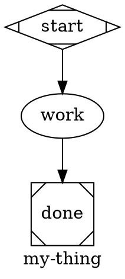
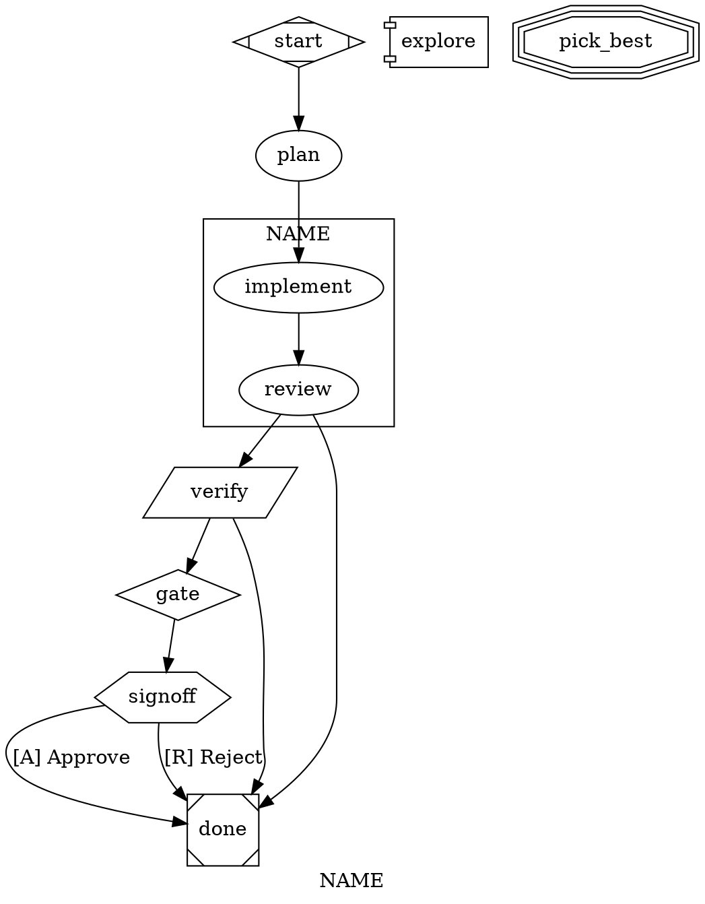

# swarm-author — writing DOT workflows that run

The goal is a small, legible `.dot` file that encodes a clear plan the runtime can execute deterministically. Start from a similar workflow in `workflows/`, keep nodes few, let edges carry the control flow, and validate before you run.

Authoritative references: `docs/SPEC.md` §3 (primitives), §4 (validation), `docs/ARCHITECTURE.md` §3 (event taxonomy) + §13.1 (declared-but-not-wired). Attribute grammar lives in `packages/core/src/types/graph.ts`. Validator codes in `packages/core/src/engine/validator.ts`.

---

## Fast path

1. **Find a template.** `.swarm/workflows/change.dot` (daily driver: plan/implement/review/verify/commit, with goal-gated review that retargets `implement` on REJECT), `.swarm/workflows/fix-bug.dot` (reproduce → fix → verify with shared `dev` thread), `.swarm/workflows/merge.dot` (single-stage rebase + CAS-fast-forward), `.swarm/workflows/showcase.dot` (every shape — parallel + fan_in + HITL + tool + diamond), `.swarm/workflows/ci-gate.dot` (all-tool, no LLM). Pick the shape that matches your problem and edit from there.
2. **Sketch the shape, not the prose.** Nodes + edges first. Name the nodes for what they *do* (`plan`, `implement`, `verify`), not what they are (`step1`, `llm_call`). Edges carry flow — `implement -> verify -> commit`. Conditional edges route on `outcome=success|fail` or `context.<key>=<val>`.
3. **Validate.** `bun run swarm validate .swarm/workflows/my-thing.dot`. Fix every error; warnings are strong hints.
4. **Smoke-run.** `bun run swarm run my-thing --input="<realistic task>"` against a cheap model first (see §9) before wiring to Opus / Sonnet.

---

## 1. The shape vocabulary

Each node has a Graphviz shape; the shape picks the handler. There is no `kind=` attribute — shape *is* kind.

| Shape | Handler | What it does | Required attrs |
|---|---|---|---|
| `Mdiamond` | `start` | Lifecycle marker. Exactly one per graph. | — |
| `Msquare` | `exit` | Lifecycle marker. At least one. | — |
| `box` (default) | `codergen` | One LLM turn with tools. The default when no `shape=` is set. | `prompt=` |
| `diamond` | `conditional` | Pure edge-routing. No LLM, no prompt. Edge `condition=`s do the work. | — |
| `hexagon` | `wait.human` | Pauses the run with `fact.run_paused_hitl`. | `prompt=` (what to ask) |
| `parallelogram` | `tool` | Deterministic shell step. | `tool_command=` |
| `component` | `parallel` | Fan-out branch spawner. Outgoing edges are the branches. | `fan_in=<id>` |
| `tripleoctagon` | `parallel.fan_in` | Joins branches. Optional `prompt=` reduces branch outputs. | — |

Loops and "wait" are *not* primitives. Loops are backward conditional edges (see §7). Waits are `wait.human` nodes. Don't look for a `loop` shape; it doesn't exist.

### Minimal skeleton



This parses, validates, and runs. Build up from here.

---

## 2. Node attributes (codergen)

`box`-shaped nodes are LLM calls. The common attrs, in decreasing order of how often you'll touch them:

| Attribute | Type | Why |
|---|---|---|
| `prompt` | string | The user-message content. Substitution is applied (§4). |
| `allowed_tools` | string[] (CSV) | Whitelist. If absent, tools are unconstrained — usually wrong; name them. |
| `model` | string | Pi-ai model id (e.g. `claude-sonnet-4-6`, `claude-opus-4-7`). Must be registered (see §9). |
| `provider` | string | Pi-ai provider (e.g. `anthropic`, `google`, `openai`). Defaults to the daemon's default. |
| `thread_id` | string | Shares the LLM thread across nodes that set the same `thread_id` (§5). |
| `context_files` | string[] (CSV) | Files from the target project root prepended to the system prompt as `<project-conventions>` blocks. `context_files = "AGENTS.md"` is the usual one. |
| `fidelity` | enum | `full | truncate | compact | summary:low | summary:medium | summary:high`. Default `compact`. See §10. |
| `max_retries` | int | Cap on backward-conditional-edge loops that target this node. See §7. |
| `reasoning_effort` | `low|medium|high` | Forwarded to providers that support it (Anthropic extended thinking, OpenAI o-series). |
| `system_prompt` | string | Override the backend's global system prompt. Useful for reviewer / planner subagents. |
| `skills` | string[] (CSV) | Scope `<available_skills>` to this list. Absent = all discovered. |
| `skills_disabled` | bool | Hard opt-out — no skills catalog in the system prompt for this node. |

Values with commas or spaces should be quoted per DOT rules: `prompt = "with, commas, ok"`. String arrays in DOT are comma-separated inside a string: `allowed_tools = "read, write, edit, bash"`.

---

## 3. Tool nodes (parallelogram)

Deterministic shell steps. Exit 0 → `outcome=success`; non-zero → `outcome=fail`. stdout/stderr are captured as artifacts (keys `<nodeId>:stdout`, `<nodeId>:stderr`).

```dot
lint [shape=parallelogram, tool_command="bun run lint"]
```

Substitution applies to `tool_command` (§4). Use tool nodes for CI gates, environment probes, idempotent side-effect commands. Don't use them for LLM prompts that happen to shell out — let the codergen node's `bash` tool do that.

Validator E008 will reject a parallelogram with an empty `tool_command` — it has nothing to dispatch.

---

## 4. Substitution tokens

Applied to `prompt`, `tool_command`, and any string attr. Order of longest-prefix-match; shell-safe mode single-quotes values.

| Token | Meaning |
|---|---|
| `$ARGUMENTS` | CLI positional input (or `--input`). One of the few things the user controls per-run. |
| `$<nodeId>.output` | Raw text output of a prior node (codergen last turn's text, or tool stdout). |
| `$<nodeId>.output.<path>` | JSON-path dive into structured output; returns `""` if absent. |
| `${context.<key>}` | Read from run context KV. `context.hitl.<nodeId>` carries HITL payloads. |
| `$RUN_ID` | Stable run identifier. Use for `.swarm/runs/$RUN_ID/summary.md`-style sidecars. |
| `$WORKTREE_PATH` | Absolute path to the per-run worktree (if the executor created one). |
| `$ARTIFACTS_DIR` | Scratch dir scoped to the run. |
| `$LOG_DIR` | Per-run dir for service logs / sidecars. |
| `$1` … `$9` | Positional args (when the CLI passed multiple). |
| `$LOOP_USER_INPUT`, `$REJECTION_REASON` | Set by the retry/HITL machinery in loops. |

Validator E005 flags `$foo.output` when `foo` isn't a node id — typos surface at parse time, not at run.

Reference an upstream node by *id*, not by `label`. `$implement.output` reads the `implement` node's output regardless of its label.

---

## 5. Thread-id (context between nodes)

Codergen nodes default to **fresh threads** — each LLM call is `priorMessages = []` + the prompt. Set `thread_id="something"` to share the message thread across nodes that declare the same thread id. Idiomatic uses:

- **`thread_id="dev"`** on `implement` + `verify` + (sometimes) `fix` — the verifier remembers what the implementer did, so "run CI and fix failures" doesn't re-read the tree from scratch.
- **No thread_id** on `plan`, `review`, `commit`, `merge` — each reads state via git, forming its own opinion. Fresh threads prevent context-poisoning from a flawed earlier turn.

Sharing a thread means sharing cost: every call sees all prior messages (modulo `fidelity=`). Use it where context *adds* value, not by default.

---

## 6. Edges and conditions

An edge with no `condition=` fires unconditionally when the source node completes. Edges with conditions are evaluated in source order; the first matching wins. Unconditional edges run only if nothing matched.

Condition grammar (see `packages/core/src/engine/condition.ts`):

```
expr := term ("&&" term)*
term := path op value
op   := "=" | "!="
path := "outcome" | "context.<key>" | "context.<key>.<sub>" | …
val  := STRING | NUMBER | IDENT | true | false | null
```

- `outcome=success` / `outcome=fail` — set by the handler on completion. Codergen outcome=fail on `<abort>…</abort>`; tool outcome from exit code.
- `context.foo=bar` — reads run context KV. HITL payloads live at `context.hitl.<nodeId>`.
- `&&` conjunction only; no `||`. Split into two edges if you need disjunction.

Idioms:

```dot
# Branch on success, unconditional fallback to done on anything else.
verify -> commit [condition="outcome=success"]
verify -> done   [condition="outcome=fail"]

# HITL approval — structured: route by edge label accelerator (§12).
signoff -> publish [label="[A] Approve"]
signoff -> draft   [label="[R] Revise"]

# Conjunction.
gate -> escalate [condition="outcome=fail && context.severity=high"]
```

Validator W003 warns when a node has only conditional edges and no `outcome=fail` catch-all — a flaky handler could then silently terminate the run.

---

## 7. Loops (backward conditional edges)

There is no `loop` primitive. A loop is an edge that points backward with a condition, bounded by `max_retries` on the *target* node:

```dot
verify [prompt = "…", max_retries = 3]
verify -> verify [condition="outcome=fail"]
verify -> commit [condition="outcome=success"]
```

`max_retries=3` means up to 3 backward-edge firings before the runtime halts with `reason=max_retries_exceeded`. Counting resets when the node is re-entered from a *different* source.

Review-loops (reject → re-plan → re-review) are the same idiom:

```dot
plan    -> review
review  -> implement [condition="outcome=success"]
review  -> plan      [condition="outcome=fail", label="rejected"]
plan    [max_retries = 2]   # cap re-plans
```

Don't chain four nodes into a loop when a single `max_retries`-capped self-edge does the job.

### Fixable-reject salvage (REJECT_FIXABLE pattern)

Full `plan → implement → review → plan` re-loops are expensive. Most rejections are narrow: a missing test, a forgotten import, a typo. For those, a separate `fix` node is cheaper than re-planning:

```dot
review  -> fix    [condition="outcome=fail", label="rejected"]
review  -> verify
fix     -> verify
fix     -> done   [condition="outcome=fail"]
```

The reviewer emits one of three markers; the fix node branches on them:

```
APPROVE: <one line>
<abort>REJECT_FIXABLE: <one line>. fixes: <numbered list, 1-3 mechanical items></abort>
<abort>REJECT: <one line — architecture / scope / contract violation></abort>
```

Fix aborts when `$review.output` starts with `REJECT:` (not fixable), when a fix strays outside the plan's file list, or when the numbered list exceeds 5 items. Hard rejects still terminate via the single `review -> fix` fail edge — `fix` itself aborts fast on them, which routes to `done`.

For workflows where most rejects are non-mechanical, prefer the `goal_gate` retarget pattern (see §13b) over a `fix` salvage node — the engine retargets to `retry_target` automatically, capped by `max_goal_gate_retries`. `.swarm/workflows/change.dot` uses this pattern: `review` is goal-gated with `retry_target="implement"`, so REJECT loops back without an explicit `review -> implement` edge.

---

## 8. Parallel (component + fan_in)

`component`-shaped nodes fan out: each outgoing edge becomes a concurrent branch. Branches must rejoin at a `tripleoctagon` named by `fan_in=`.

```dot
explore [shape=component, fan_in=pick_best, join_policy="wait_all"]

approach_correctness [prompt = "find CORRECTNESS risks — one per line", allowed_tools = "read, bash"]
approach_style       [prompt = "find STYLE regressions",                allowed_tools = "read, bash"]
approach_security    [prompt = "find SECURITY concerns",                allowed_tools = "read, bash"]

pick_best [shape=tripleoctagon]                   # optional prompt = reduce

explore -> approach_correctness
explore -> approach_style
explore -> approach_security
approach_correctness -> pick_best
approach_style       -> pick_best
approach_security    -> pick_best
```

- `join_policy="wait_all"` (default) — fan_in fires when every branch completed.
- `join_policy="first_success"` — fan_in fires as soon as any branch returns success; others are aborted.
- `fan_in`'s `prompt` (if present) reduces the branches; if omitted, a heuristic concatenates branch outputs.

Validator E007 catches missing/wrong `fan_in` targets.

HITL inside a parallel branch is **not supported** in v1 (§13.1) — a `yield_hitl` inside a component coerces to `fail`. Put HITL outside the fan-out.

---

## 9. Models, providers, validation

`POST /workflows` enforces model validity at registration time. Offenders get `code="model_unresolved"` with a list of `{provider, model, reason}`. This happens *before* enqueue — a bad `model=` fails fast.

Rules of thumb:

- Use `model="claude-sonnet-4-6"` for mid-tier nodes (implement, verify, commit, merge). Fast, cheap, good enough.
- Reserve `model="claude-opus-4-7"` (or equivalent) for `plan` / `review` nodes where reasoning matters.
- Tool nodes don't take `model=`.
- Unset means the daemon's default — fine for quick drafts, explicit is better for committed workflows.

Check what's available:

```sh
bun run swarm providers ls                               # which providers are credentialed
bun run swarm providers test anthropic claude-sonnet-4-6 # 1-token smoke call
```

Registering a custom model (e.g. a local Ollama) goes through `~/.swarm/models.json`. Not this skill's territory — see `docs/providers.md`.

---

## 10. Fidelity and context_files

### Fidelity (`fidelity=`)

Controls how prior messages are folded into the next call:

- `full` — every prior message verbatim. Most expensive; rarely needed.
- `truncate` — pi-agent-core's default truncation. Good for long threads where tail matters.
- `compact` — summary of head + recent tail (swarm default).
- `summary:low|medium|high` — pre-digest via a summariser; `summary:high` is the cheapest and the blurriest.

Default on codergen is `compact`. Override per-node (`fidelity="summary:medium"`) or per-graph (`default_fidelity="truncate"`).

### context_files

Comma-separated list of paths relative to the target project root. Contents prepend to the system prompt as `<project-conventions>` blocks. `context_files = "AGENTS.md"` is the common case — give the agent the rules before asking it to write code.

Don't stuff `docs/*.md` in wholesale; the system prompt is under the 4KB `llm.start` event cap and evictions degrade the signal. One file with the hard rules is worth three with general background.

---

## 11. Prompts that behave

The prompt is the contract between you and the agent. A few patterns that work:

### Authoritative task

Make `$ARGUMENTS` the only source of truth; refuse when empty:

```
Task (authoritative, do not substitute): $ARGUMENTS.
If $ARGUMENTS is empty, names nothing specific, or the target is blocked,
emit `<abort>missing or blocked target</abort>`. Do NOT retarget silently.
```

### Abort sentinels

A node that decides the run can't proceed emits `<abort>reason</abort>` in its final text. The runtime reads this, records `outcome=fail`, writes `fact.node_aborted { cause:"aborted_exit" }`, and the run halts with `reason:"aborted_exit"` unless a downstream edge routes on it.

```
If the task needs more than the workflow can handle (multi-package refactor, contract change), emit `<abort>task too large, split into <suggested>: <reason></abort>`.
```

### Promise sentinels

Consistent end-of-phase tokens make downstream nodes' parsing trivial and give humans a visible success marker:

```
Emit `<promise>PLAN_READY</promise>` when done.
```

Downstream nodes can reference `$plan.output` — the full text — without fragile regex parsing.

### Explicit tool whitelist

Always name the tools:

```
allowed_tools = "read, write, edit, bash"            # implement/verify nodes
allowed_tools = "read, bash"                          # plan/review/analysis nodes (read-only)
allowed_tools = "read"                                # pure review, no git state reads
allowed_tools = "write"                               # summary-only writer nodes
```

Unconstrained tools surprise operators. Read-only planners stop the agent from editing; write-only summarisers stop them from wandering.

### Keep prompts short

Long prompts mean the agent spends tokens re-parsing your essay. `change.dot`'s `plan` prompt is ~150 words — that's a reasonable upper end for a production node. If you're over 300 words, either split the node or move rules to `context_files`.

---

## 12. Wait.human (HITL nodes)

`hexagon`-shaped nodes pause the run and ask the operator a question. The payload of `fact.run_paused_hitl` carries the node's `prompt` and the **edge labels** as the operator's options. The operator resumes with `POST /runs/:id/hitl { input }`; the structured handler picks the outgoing edge whose label matches the operator's selection by accelerator key.

```dot
signoff [
  shape  = hexagon
  prompt = "Reviewers found issues. Approve to ship, or reject."
]

signoff -> publish [label="[A] Approve"]
signoff -> draft   [label="[R] Reject"]
```

The accelerator key (the `K` in `[K] Label`) becomes the operator-facing button identifier and the routing key. Keys must be unique across the hexagon's outgoing edges (E010); structured HITL routes by accelerator-normalised match.

**Don't** put `condition="context.hitl.<nodeId>=…"` on hexagon outgoing edges — that's the legacy codergen-driven path, and the structured handler doesn't write `context.hitl.*` for label-routed gates. W004 flags it. The input the operator submitted is still recorded for audit (visible in events), but routing comes from the label.

Keep the prompt to one sentence + the option set the labels imply. Open-ended free-text gates need a downstream codergen node to parse the answer; for those, omit edge labels and let the codergen read the input via substitution.

See swarm-run §5 for the resume mechanics.

---

## 13. Graph-level attrs

```dot
graph [
  goal                  = "one-sentence purpose; shown in the UI and summarisers"
  label                 = "my-thing"
  default_fidelity      = "compact"
  default_max_retries   = 2
  default_retry_policy  = "standard"      # preset name (§13b)
  retry_target          = "implement"     # graph-level §3.4 retarget (§13a)
  fallback_retry_target = ""
  max_goal_gate_retries = 2               # cap on §3.4 retargets (default 3)
  model_stylesheet      = "* { … }"       # CSS-for-models (§13c)
  budget_usd            = 5.00            # halts at cumulative ≥ ceiling
  budget_tokens         = 200000          # same
  budget_policy         = "stop"          # "stop" (default) | "warn" (non-blocking)
]
```

- `goal` — keep it short. Summarisers read this when deciding what matters in the run.
- `default_fidelity`, `default_max_retries`, `default_retry_policy` — defaults cascade into nodes unless overridden. `default_max_retry` (singular) is accepted as a legacy alias of `default_max_retries`.
- `budget_*` — **wired** as of §3.7. `budget-policy.ts` evaluates `cumulative >= ceiling` at every turn boundary; `budget_policy="stop"` halts the run with `fact.run_halted { reason: "budget" }`, `budget_policy="warn"` emits `budget.warn` / `budget.stop` events without halting. Same semantics for node-level `max_cost_usd` / `max_tokens`. Use these for real caps, not just documentation.
- `retry_target`, `fallback_retry_target`, `max_goal_gate_retries` — see §13a.
- `model_stylesheet` — see §13c.

---

## 13a. Goal gates and retargets

A **goal gate** is a node that *must* succeed before the pipeline can exit. Mark it with `goal_gate=true`. When the run reaches a terminal (`Msquare`) node, the engine checks every visited gate's outcome — if any is non-success, it retargets to the `retry_target` on that gate (or the fallback chain) instead of completing.

The §3.4 chain, in priority order:

1. failed gate's `retry_target`
2. failed gate's `fallback_retry_target`
3. graph-level `retry_target`
4. graph-level `fallback_retry_target`
5. halt with `fact.run_halted { reason: "goal_gate_unsatisfied", gate: "<id>" }`

Bounded by `max_goal_gate_retries` (graph attr, default 3). Once that's exhausted, the run halts even if the chain has more steps. This is swarm-local — attractor §3.4 step 4 is unbounded; we cap to keep a misconfigured retry target from burning the run forever.

Idiomatic pattern (`change.dot`):

```dot
graph [ retry_target = "implement", max_goal_gate_retries = 2 ]

review [
  prompt       = "Judge the diff. Reply APPROVE or <abort>REJECT: …</abort>."
  goal_gate    = true
  retry_target = "implement"
]

review -> done   [condition="outcome=fail"]   # fast-fail to terminal …
review -> verify                                # … on success, advance.
```

REJECT routes via the fail edge to `done`; the goal-gate enforcement at `done` sees `review` unsatisfied and retargets to `implement`. After `max_goal_gate_retries` failed cycles, the run halts. No `review -> implement [condition="outcome=fail"]` edge needed.

**Distinct from `max_retries`.** `max_retries` is the *handler*-level retry count (the engine retries the same node N times on RETRY/transient failure within one workflow pass). `goal_gate` retargets are *workflow*-level retries (the engine jumps backwards through the graph and re-runs upstream nodes). A node can use both: handler-level retries first, then if the final outcome is still bad, the gate retargets.

W007 fires on a `goal_gate=true` node with no retarget at any level — failure can only halt with no recovery path. Almost always an authoring oversight; either set a target or drop the gate.

---

## 13b. Retry policy presets

`retry_policy` (node) and `default_retry_policy` (graph) pick a backoff preset for handler-level retries. Combined with `max_retries`, they govern how the executor retries a single node when its outcome is RETRY (or it throws a retryable exception).

| Preset | maxAttempts | initial | factor | maxDelay | Use for |
|---|---|---|---|---|---|
| `none` (default) | 1 | 0 | 1.0 | 0 | Fail immediately. |
| `standard` | 5 | 200ms | 2.0 | 60s | General-purpose flake. |
| `aggressive` | 5 | 500ms | 2.0 | 60s | Unreliable upstreams. |
| `linear` | 3 | 500ms | 1.0 | 500ms | Fixed-delay polling. |
| `patient` | 3 | 2000ms | 3.0 | 60s | Long-running ops. |

Two outcome flags interact with retries:

- **`non_retryable`** (Outcome flag set by the handler) — short-circuits retries. Use for auth errors, 4xx, validation: don't retry, just fail.
- **`allow_partial`** (node attr, boolean) — converts retry-counter exhaustion into `PARTIAL_SUCCESS` instead of `FAIL`. The run continues forward as if it succeeded, with a note. Use when "best-effort" is acceptable.

Backoff happens *outside the executor slot* as of the recent `paused_retry` rework: a retrying run transitions to status `paused_retry`, frees its concurrency slot, and the wake-pending sweeper re-queues it once the backoff timer elapses. This means heavy backoff doesn't starve other runs.

W008 catches typos in preset names — the runtime falls back to `none` silently otherwise.

---

## 13c. Model stylesheet

The `model_stylesheet` graph attr provides CSS-like rules for `llm_model`, `llm_provider`, and `reasoning_effort` defaults across nodes. Saves you from per-node `model="…"` pins on every codergen.

```dot
graph [
  model_stylesheet = "
    *           { llm_provider: anthropic; llm_model: claude-sonnet-4-6; }
    .review     { llm_model: claude-opus-4-7; reasoning_effort: high; }
    #pick_best  { llm_model: claude-opus-4-7; }
  "
]
```

**Selectors** (specificity 0 → 3):

| Selector | Matches | Specificity |
|---|---|---|
| `*` | All nodes | 0 |
| `box` (or any shape name) | Nodes with that shape | 1 |
| `.classname` | Nodes whose `class` attr or subgraph-derived class includes `classname` | 2 |
| `#nodeId` | Specific node by id | 3 |

Properties: `llm_model`, `llm_provider`, `reasoning_effort` (low/medium/high). Recognised set is closed; `parseStylesheet` rejects others (E015).

**Resolution order** (highest precedence first):

1. Explicit node attr (`model = "…"`, `provider = "…"`)
2. Stylesheet rule (by specificity, later-wins on tie)
3. Daemon default

Apply once at the graph level, not per-node — that's the whole point. E015 fires on parse errors at validate-time so you don't ship a broken stylesheet.

---

## 13d. Subgraphs (scope + class derivation)

`subgraph cluster_<name> { … }` does two useful things:

1. **Scopes default attrs** to the contained nodes. A `node [thread_id="dev"]` block inside a subgraph applies that default to nodes declared inside, without leaking to siblings.
2. **Derives a class** named `<name>` (the part after `cluster_`) on every node inside, available to stylesheet `.classname` selectors and the node's `classes` array.

```dot
subgraph cluster_dev {
  node [thread_id = "dev"]                  // scope-local default

  implement [ prompt = "…" ]                // gets thread_id="dev" + class "dev"
  review    [ prompt = "…", goal_gate=true, retry_target = "implement" ]
}
```

The `change.dot` daily driver uses this to put `implement` + `review` in a shared `dev` thread automatically. Future stylesheet rules on `.dev` will pick up both. A subgraph without the `cluster_` prefix uses its id as the derived class name.

---

## 14. Validation

`bun run swarm validate .swarm/workflows/my-thing.dot` is the fast feedback loop. Fix every error; take warnings seriously.

| Code | Severity | What it means |
|---|---|---|
| E001 | error | No start node (missing `shape=Mdiamond`). |
| E002 | error | Multiple start nodes — pick one. |
| E003 | error | No exit node (`shape=Msquare`). |
| E004 | error | Edge references a node id that doesn't exist. Typo in source or target. |
| E005 | error | `$foo.output` references an unknown node id. |
| E006 | error | Cycle with no reachable exit — the run can't terminate. |
| E007 | error | `component` node without valid `fan_in=` (missing or wrong shape). |
| E008 | error | `parallelogram` node without `tool_command=`. |
| E009 | error | `hexagon` node has no outgoing edges — operator's selection has nowhere to route. |
| E010 | error | `hexagon` outgoing edges produce duplicate accelerator keys (e.g. two `[A] …` edges). |
| E011 | error | `retry_target` / `fallback_retry_target` references an undefined node (gate or graph level). |
| E012 | error | Start node has incoming edges (attractor §11.2). |
| E013 | error | Exit node has outgoing edges (attractor §11.2). |
| E014 | error | Edge `condition` failed to parse — most often a literal containing whitespace (`condition="preferred_label=RANK: clean"` won't parse; quote the literal or use an underscored sentinel like `RANK_CLEAN`). |
| E015 | error | `model_stylesheet` syntax error — surfaces parse failures at validate-time. |
| W001 | warn  | Orphan node (no in-edges, not start). Usually a copy/paste leftover. |
| W002 | warn  | Node unreachable from start. Dead code. |
| W003 | warn  | Node has only conditional edges, no `outcome=fail` catch-all. |
| W004 | warn  | Hexagon outgoing edge uses legacy `context.hitl.*` condition; structured HITL routes by `[K] Label` accelerators (§12). |
| W005 | warn  | Duplicate edge. |
| W006 | err   | Cycle with no exit reachable from it (promoted from warn). |
| W007 | warn  | `goal_gate=true` node has no retarget at any level — failure can only halt. |
| W008 | warn  | `retry_policy` / `default_retry_policy` is not a known preset (`none|standard|aggressive|linear|patient`). |
| W009 | warn  | Codergen (`box`) node has empty `prompt` and empty `label` — the agent has nothing to act on. |
| W010 | warn  | `fidelity` value not recognised — runtime falls back to `compact`; surfaces typos like `compcat`. |

Pass `--strict` if you want warnings to fail the command; none of the CLI flags expose that yet, but the API (`validate(graph, {strict:true})`) supports it.

---

## 15. Smoke-test recipe

Between "it validates" and "it runs with your production model", there's this:

```sh
# 1. Parse+lint.
bun run swarm validate .swarm/workflows/my-thing.dot

# 2. Dry-enqueue with a cheap model. Override in the .dot if every node
#    pins a model — `provider` / `model` at node level is the only way.
bun run swarm run my-thing --input="a realistic sample task"

# 3. Watch. Expect to see fact.run_started → fact.node_started (per node)
#    → intermittent llm.text_delta → fact.node_completed → ... → terminal.
```

If you have the budget, run it twice — once cold, once with the prior run's artifacts removed. Prompts that only work the second time (e.g. because they silently relied on a cached file) are a trap in production.

---

## 16. Anti-patterns

- **Don't write a `loop` node.** Backward conditional edges are the pattern. If you find yourself wanting three nodes to form a loop, you probably want one node + a self-edge.
- **Don't pack two jobs into one node.** A node has one prompt, one thread, one model, one set of tools. If the prompt is "do A, then B, then C" — three nodes.
- **Don't leave `model=` unset in a shipped workflow.** The daemon default is fine for drafts; explicit pins make cost and quality predictable across machines.
- **Don't `context_files = "docs/SPEC.md, docs/ARCHITECTURE.md, README.md"`.** You'll blow the event payload cap and bury the real rules. One file with the hard constraints, usually `AGENTS.md`.
- **Don't re-invent `<abort>` / `<promise>`.** Downstream nodes already know how to read them. A custom sentinel requires a parser; a standard one just works.
- **Don't conditionally route on `outcome=error`.** The states are `success` and `fail`. `fact.run_halted { reason:"error" }` is a terminal event, not an edge-eligible outcome.
- **Don't edit a workflow mid-run.** `workflow_sha` is pinned at enqueue (SPEC §5). Your edit applies only to *future* runs.
- **Don't put HITL inside a parallel branch.** Not supported (§13.1); it coerces to fail.
- **Don't use `[condition="context.hitl.<id>=…"]` on hexagon edges.** That's the legacy codergen-driven HITL path. The structured HITL handler routes via edge labels: `signoff -> run_tests [label="[A] Approve"]`. W004 flags it.
- **Don't pair `goal_gate=true` with no retarget.** W007. A gate that can only halt isn't a gate — it's a foot-gun. Either give it a `retry_target` or drop the flag.

---

## Cheat sheet



```sh
# Iterate.
bun run swarm validate .swarm/workflows/my-thing.dot
bun run swarm run      my-thing --input="…"   # bare-name resolves under .swarm/workflows/
```

When a workflow misbehaves, switch to swarm-debug to post-mortem the run. When a run needs steering or pausing mid-flight, switch to swarm-run.
