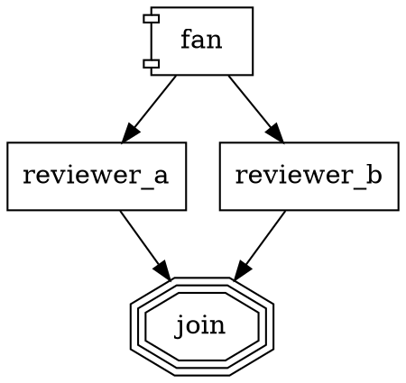

# swarm — conventions for AI agents

> Read this first. If anything here conflicts with the specs, the specs win — update this doc.

## What is this repo

**swarm** is a universal AI agent orchestrator. See `docs/SPEC.md` for what the system is and `docs/PLAN.md` for the incremental build plan. `docs/ARCHITECTURE.md` captures deeper design rationale.

The current phase and its verification bar live in `docs/PLAN.md`. Do not start work outside the current phase without discussion.

## Ground rules

1. **Spec-first.** If you're about to write code that isn't in `docs/SPEC.md` or `docs/PLAN.md`, stop. Either update the spec first or check in with the user.
2. **Tests before declaring done.** No task is complete until the phase's verification bar passes. `bun test` green is table stakes, not success.
3. **No dependencies added silently.** Every new runtime dep goes through `package.json` with an exact version pin and a one-line rationale in the commit message.
4. **Pure core.** `@swarm/core` imports nothing from `node:fs`, `node:child_process`, `node:net`, or anything that touches the outside world. Violation is a build failure.
5. **Events are the source of truth.** Every non-trivial state transition emits a typed event. UI, replay, and cost reports all derive from the event log.
6. **NO INLINE IMPORTS.** All `import` statements live at the top of the file — no `await import(…)` inside functions, no `require(…)` inside conditionals. Dynamic imports hide dependency graphs, break static analysis, and routinely produce the "why did this not get bundled?" bug during refactors. If you need lazy behaviour, hoist the import and guard the call instead. Rare exception: genuinely-circular module graphs that can't be broken up — document the cycle in a comment next to the dynamic import before shipping.

## Stack

- **Runtime:** Bun ≥ 1.2 (primary), Node ≥ 20 (compat fallback)
- **Language:** TypeScript strict (`strict`, `noUncheckedIndexedAccess`, `exactOptionalPropertyTypes`)
- **Schemas:** `@sinclair/typebox`
- **Test runner:** `bun test`
- **Lint / format:** `biome` (single tool, replaces eslint + prettier)
- **Agent runtime:** `@mariozechner/pi-agent-core`
- **LLM client:** `@mariozechner/pi-ai`
- **Logging:** `pino` with `{domain}.{action}_{state}` naming
- **Property-based tests:** `fast-check`
- **Web client:** React 18 + Vite 5 + Tailwind 3 + react-router v7, Radix primitives for a11y, lucide-react for icons

## Commands

```sh
bun install              # install deps
bun run typecheck        # tsc --noEmit across workspace
bun test                 # run all package test suites
bun run lint             # biome check
bun run format           # biome format --write
bun run ci               # typecheck + lint + test (what CI runs)

bun run swarm run <workflow.dot>       # once @swarm/cli exists (Phase 2+)
bun run swarm validate <workflow.dot>
bun run swarm replay <events.jsonl>
```

## Repository layout

```
/Users/bandarra/swarm/
├── docs/                  # SPEC.md, PLAN.md, ARCHITECTURE.md
├── packages/
│   ├── core/              # pure orchestrator (no I/O)
│   ├── agent/             # pi-mono wrapper
│   ├── workspace/         # ExecutionEnvironment adapters
│   ├── events/            # EventSink adapters + shared cost accumulator
│   ├── cli/               # single-command entry (run, serve, replay, …)
│   ├── server/            # Hono HTTP + SSE (Phase 5)
│   └── web/               # React + Vite dashboard (Phase 5)
├── examples/              # demo workflows
├── workflows/             # swarm's own workflows (self-hosting)
├── scripts/               # one-shot maintenance scripts (e.g. event backfill)
└── .swarm/runs/           # runtime event logs (gitignored)
```

## Commit conventions

- Commit messages use imperative mood ("add X", not "added X").
- Tag the phase in the subject: `[P1] add edge selection 5-step priority`.
- Every non-trivial change updates a test. If the change is infeasible to test, say so explicitly in the commit body.
- `git commit --no-verify` is banned. Fix the hook, don't skip it.

## Self-hosting

swarm can implement its own new features. To drive a feature change through the harness:

```sh
# Default: Claude Haiku via ANTHROPIC_API_KEY
export ANTHROPIC_API_KEY=sk-...
bun run packages/cli/bin/swarm.ts run workflows/build-feature.dot \
  --input="add a local:list_dir tool that lists files in a directory"

# OpenRouter (one key → 300+ models across every major provider)
export OPENROUTER_API_KEY=sk-or-...
bun run packages/cli/bin/swarm.ts run workflows/build-feature.dot \
  --provider openrouter --model "anthropic/claude-opus-4.7" \
  --input="..."

# Any of: openai, google, groq, cerebras, xai, mistral, vercel-ai-gateway,
# github-copilot, amazon-bedrock, google-vertex — see `swarm providers`.

# Replay the run afterwards
bun run packages/cli/bin/swarm.ts replay .swarm/runs/<id>/events.jsonl
```

If an agent-backed node decides its task is unreachable (missing target,
contradictory constraints, external blocker) it emits
`<abort>short reason</abort>` in its final message. The backend turns that
into a non-retryable `fail` outcome; workflows wire
`condition="outcome=fail"` edges to terminate the run immediately instead
of forwarding to downstream no-op steps. See `docs/SPEC.md` §3.7 for the
contract.

### Running the server

Start the HTTP + SSE server for the web UI / TUI / any other client:

```sh
bun run packages/cli/bin/swarm.ts serve --port 3000
# → swarm serve listening on http://localhost:3000
curl http://localhost:3000/health   # {"ok":true}
```

Flags: `--port <n>` (default 3000; `0` picks an ephemeral port for tests),
`--runs-dir <path>` (default `.swarm/runs`), `--cwd <path>`. `Ctrl-C`
triggers a graceful shutdown. No auth / HTTPS — put a reverse proxy in
front if exposing beyond localhost.

REST surface at time of writing: `GET /health`, `GET /pipelines`,
`GET /pipelines/:id`, `GET /pipelines/:id/steps` (Wave 5 —
`StepSnapshot[]` reconstructed from `llm.start` + companion events),
`GET /stats` (aggregate tiles for the Home dashboard — total /
running / succeeded / failed, success rate, total cost + tokens, avg
duration), `GET /runs/:id/events` (SSE), plus the interview and
workflows routes. Shapes live in `packages/server/src/schemas.ts`.

**Read-side abstractions (Wave 5).** `@swarm/events` exposes the
inverse of `EventSink`:

- `EventSource` — `listRuns() + readRun(runId)`; the port that
  JSONL / Postgres / OTel adapters implement.
- `Projection<T>` — pure reducer `Event[] → T`. `stepsProjection` and
  `summaryProjection` are the first consumers.
- `projectRun(source, runId, projection)` — sugar for "load run →
  handle 404 → project". `foldAll(source, projection, folder, init)`
  is the aggregate path (e.g. `/stats`).
- `MaterializedProjectionStore<T>` — optional interface a DB adapter
  implements when it wants to precompute + cache projections.
- `migrateAllRuns(source, sink)` — supported path for moving an
  archive between backing stores (JSONL → Postgres, etc.). Idempotency
  is the sink's job.

The web `<StepInspector>` component fetches `StepSnapshot[]` and
renders collapsible sections per step (prompt · system prompt ·
messages · tools · context files · settings · budget · cost · final
text). Toggle between `Conversation` and `Steps` tabs on
`/pipelines/:id`.

### Per-step agent context (introspection)

Every `llm.start` event on the SSE stream carries the full resolved
context for one agent step so the UI / replay layer never has to
reconstruct state out of band. Authoritative per-step fields (see
`docs/SPEC.md §3.5`):

- `prompt`, `system_prompt`, `provider`, `model`
- `thread_id`, `allowed_tools`, `denied_tools`
- `iteration: { n, max }` on every loop-originated call
- `messages`: prior turns visible to the agent when a shared `thread_id`
  restored a pi-agent-core session (omitted on fresh sessions)
- `settings`: resolved generation knobs (`temperature`, `max_tokens`,
  `top_p`, `reasoning_effort`, `stop`)
- `context_files`: `[{ path, sha256, bytes, truncated, status }]` — use
  the sha256 to detect drift between a run and a later replay
- `budget`: read-only snapshot (`cumulative_cost_usd`,
  `cumulative_tokens`, `max_cost_usd?`, `run_max_cost_usd?`); emitted
  only when a ceiling is configured until Wave 4 wires real counters

The envelope carries `schema_version` (current: `1`). Pre-versioned
JSONL omits the field; validators must treat `undefined` as `1`. Use
`validateEvent(raw, { checkPayload })` from `@swarm/events` to check
event shapes at boundaries (replay harnesses, ingestion).

### Fidelity modes (what each one actually does)

swarm owns a per-backend `MessageStore` keyed by `thread_id`
(`packages/agent/src/message-store.ts`). pi-agent-core's `sessionId` is
only a provider-cache hint — the store is what makes `fidelity=full`
restore prior turns across nodes.

| Mode | Prior turns restored | Seed prepended to user prompt | sessionId bucket |
|---|---|---|---|
| `full` | yes (from store) | none | `thread_id` |
| `truncate` | no | goal + run_id only | `thread_id:truncate` |
| `compact` | no | digest (role census + latest assistant text, ≤1.5 KB) | `thread_id:compact` |
| `summary:low` | no | deterministic template (≤600 char tail) | `thread_id:summary:low` |
| `summary:medium` | no | same as `summary:low` + `agent.warning` | `thread_id:summary:medium` |
| `summary:high` | no | same as `summary:low` + `agent.warning` | `thread_id:summary:high` |

Resolution chain: edge attr → target node attr → `graph.default_fidelity`
→ hard default `compact`.

Node-level overrides that ride on top of fidelity:

- `context = "fresh"` — hard opt-out. Ignores store, doesn't persist,
  omits `sessionId` entirely. Useful for one-off diagnostic nodes that
  must not see the rest of the run.
- `system_prompt = "…"` — per-node system-prompt override (e.g. a
  reviewer / planner persona). Context-files block is still prepended.

Goal-gate retry is **two-phase**: `retry_target` spends up to
`max_goal_gate_retries`, then — if a *distinct* `fallback_retry_target`
is set — the budget resets and the fallback gets its own round. When
`retry_target` is unset but `fallback_retry_target` is, it's used as
the primary (single phase).

### Summariser + auto-title (Wave 2b)

A cheap-model summariser (separate from the coder model) powers two
adjacent features:

1. **Pipeline auto-title** — `execute()` fires a fire-and-forget
   summariser call over `$ARGUMENTS` at pipeline start. When the call
   returns, `pipeline.title_generated` is emitted (synthetic `node_id =
   __summary.title`) and the title is mirrored into
   `context["graph.title"]` so prompts can substitute it. UIs fall back
   to `input` (raw `$ARGUMENTS`) then `workflowName`. Disable with
   graph attr `auto_title = "off"` or CLI flag `--no-auto-title`.
2. **Fidelity `summary:medium` / `summary:high`** — the same summariser
   compresses prior transcript for these modes. Synthetic `node_id` is
   `__summary.<caller>` (+ `#<iter>` in loops). On failure it falls
   back to the deterministic `summary:low` template with a warning.

Each summariser call emits `summary.started` + `summary.completed` +
its own `cost.recorded` under the synthetic `node_id`, so cost totals
are correct without any bespoke aggregation. Drilldown surfaces can
render each synthetic node as a lightweight step in the timeline.

Configure in `.swarm/config.yaml`:

```yaml
defaults:
  summariser:
    provider: openrouter
    model: anthropic/claude-haiku-4.5
auto_title: on
```

CLI flags: `--summariser-provider <name>`, `--summariser-model <id>`,
`--no-auto-title`. Flags win over config.

Retrofit titles onto pre-Wave-2b runs with
`bun run scripts/backfill-titles.ts [--dry-run]`. The script is
idempotent (skips runs that already carry `pipeline.title_generated`)
and append-only (never rewrites existing event lines).

### Budgets (Wave 4)

Cost + token ceilings are enforceable at node and run scope:


The `BudgetLedger` in `@swarm/core/engine/budget.ts` is a pure reducer
over `cost.recorded` events. When the cumulative crosses 80 % of any
ceiling, `budget.warn` fires once; at 100 %, `budget.stop` fires once
and — under `stop` policy — the next codergen call fails
non-retryably (so goal-gate retries don't relaunch the breach). Both
events ride under the synthetic `__budget` node so drilldown surfaces
render them alongside summariser events.

`llm.start.budget` carries the real cumulative snapshot
(`cumulative_cost_usd`, `cumulative_tokens`, plus the ceilings) as
soon as *any* budget knob is declared. Synthetic `__summary.*`
summariser calls contribute to the run-level total but do NOT count
against the caller node's `max_cost_usd` — a tight per-node cap can
still trigger richer fidelity compressions.

### Web UI

The React + Vite client lives in `packages/web/`. The app sits inside a
persistent `AppShell` (sidebar + breadcrumb header + connection badge)
and routes to:

- `/` — Home dashboard (stats tiles from `GET /stats` + recent runs)
- `/pipelines` — full pipelines list (the table-shaped view)
- `/pipelines/:id` — per-run detail with graph + active-node highlight
- `/workflows` — workflow catalog
- `/settings` — client settings

Metrics (cost, input/output tokens, duration) are derived server-side
from `cost.recorded` events and rendered in both the list and the detail
header. The sidebar reads connection status from `HealthContext`, so the
route tree stays stable across health-status flips (tests rely on this).

The web surface standardizes on **Vercel AI Elements** end-to-end
(`Workflow` for the graph, Chatbot family for drilldown, human-in-the-loop
set for steering). The currently-shipped Graphviz-wasm renderer is being
swapped for AI Elements' `Workflow` in P5.12; the event timeline (P5.07)
and drilldown (P5.08) are still pending. The dashboard shell (P5.13) is
partially landed — `AppShell` + Home/Workflows/Pipelines/Settings routes
exist; individual tiles and workflow-catalog content are still filling in.

```sh
# Terminal A — start the HTTP/SSE server
bun run packages/cli/bin/swarm.ts serve --port 3000

# Terminal B — start the Vite dev server on :5173 (proxies /api → :3000)
bun run --filter='@swarm/web' dev
```

Open http://localhost:5173 — the sidebar footer flips to **connected** once
the proxy reaches `/health`. Build a static bundle with
`bun run --filter='@swarm/web' build` → `packages/web/dist/`.

**Dev proxy configuration.** The Vite dev server proxies `/api/**` to the
swarm server. The target defaults to `http://localhost:3000`; override
with `SWARM_SERVER_URL` if the server is on a different port or host:

```sh
SWARM_SERVER_URL=http://localhost:4000 bun run --filter='@swarm/web' dev
```

The client code always uses the relative `/api/...` prefix (see
`packages/web/src/lib/api.ts` — the URL discipline comment there is
load-bearing). See `packages/web/README.md` for more detail.

**User-facing timestamps and numbers** flow through the locale-aware
helpers in `packages/web/src/lib/time.ts` (dates, relative "3 min ago")
and `packages/web/src/lib/format.ts` (USD cost, token counts via
`Intl.NumberFormat`). Never render a raw ISO string or bare number to
the user — add a helper there if one is missing.

### Mid-run steering

Send a new user message into a running swarm process:

```sh
bun run packages/cli/bin/swarm.ts steer <run-id> "please also add a test"
```

The message is appended to `.swarm/runs/<run-id>/steering.jsonl`. The running
backend tails the file (≤500ms poll) and injects each line into the active
agent via pi-agent-core's `agent.steer()`. A `steering.injected` event lands
in the run's `events.jsonl` for audit, and the web UI renders it as a user
message inside the active node's current turn so the steer is visible the
moment it reaches the backend.

### Parallel branches + fan_in

`shape=component` nodes fan out to all outgoing edges as isolated branches
that converge at a `shape=tripleoctagon` node:



Each branch gets a cloned context (writes don't leak to siblings). Branch
context updates merge back via `parallel.branch_results`, `parallel.count`,
and `parallel.successes`. `join_policy="first_success"` returns when the
first branch succeeds.

### Model stylesheet

Assign models/providers by selector instead of repeating per node:

```dot
digraph {
  model_stylesheet = "[shape=box] { model: claude-haiku-4-5 } .heavy { model: claude-opus-4-7; reasoning_effort: high } #explore { model: claude-sonnet-4-6 }"
  ...
}
```

Selectors: `#id`, `.class`, `[shape=X]`, `[attr=value]`. Node-level attrs
always win over the stylesheet.

### Subagent tool

`local:subagent` spawns a focused nested agent (fresh context, its own
tool set, strict timeout, no recursion). Useful for exploration or triage
without polluting the main conversation:

```
local:subagent({
  prompt: "find which files import FooBar",
  timeout_ms: 30000,
  allowed_tools: ["local:grep", "local:read_file"]
})
```

### Worktree isolation

`--worktree` spawns a git worktree under `.swarm/worktrees/<run-id>/` on a
branch named `swarm/<run-id>`. The agent runs entirely inside it; your
working copy and current branch stay untouched. On success, `git checkout
swarm/<run-id>` to review + merge; on failure (or always if you want
post-mortem access) add `--keep-worktree` to preserve the directory + branch
after the run:

```sh
bun run packages/cli/bin/swarm.ts run workflows/add-tool.dot \
  --input="add local:touch tool" \
  --worktree
```

`node_modules` is symlinked from the main repo into the worktree so
`bun test` / `bun run ci` work without a reinstall. Caveat: `bun install`
inside the worktree mutates the shared cache — swarm will still run, but
you may see `bun.lock` changes bleed back to the main repo.

### Inference provider ≠ model provider

swarm separates two concepts that are often conflated:

- **Inference provider** — the API endpoint / where the request goes. This is the `--provider` flag. Choices: `anthropic`, `openai`, `google`, `openrouter`, `vercel-ai-gateway`, `amazon-bedrock`, `google-vertex`, `github-copilot`, `groq`, `cerebras`, `xai`, `mistral`.
- **Model provider** — who trained the weights. This is encoded *inside* the model id. On aggregator inference providers (openrouter, vercel-ai-gateway, bedrock, vertex) the model id is namespaced: `anthropic/claude-haiku-4.5`, `google/gemini-2.5-pro`. On direct providers (anthropic, openai, google) the id is bare: `claude-haiku-4-5`, `gpt-4o`.

Examples:

```sh
# Direct Anthropic API — bare model id
--provider anthropic --model claude-opus-4-7

# OpenRouter serving Anthropic — namespaced id
--provider openrouter --model anthropic/claude-opus-4.7

# OpenRouter serving Google
--provider openrouter --model google/gemini-2.5-pro
```

Omit `--model` and swarm uses that provider's default (see `swarm providers`). The CLI runs a pre-flight check against pi-ai's registry before starting — bad combos fail immediately with a list of valid ids, not after 30 retries.

- List all providers + their defaults + a few valid model ids:
  ```sh
  bun run packages/cli/bin/swarm.ts providers
  ```
- Override per-node inside the workflow: `myNode [provider="openrouter", model="google/gemini-2.5-pro"]`.
- API keys are picked up from standard env vars automatically (`ANTHROPIC_API_KEY`, `OPENAI_API_KEY`, `OPENROUTER_API_KEY`, `GEMINI_API_KEY`, etc.). The CLI refuses to run against a provider whose env var is missing and prints the exact variable name you need.
- Goal-gate retries are capped at 3 by default; override with `graph [max_goal_gate_retries = N]` in a workflow.

Related:
- `workflows/build-feature.dot` — plan → implement_and_review loop → verify → summarize
- `.swarm/config.yaml` — per-project defaults + workflow shortcuts

The agent writing code on swarm's behalf has full access to `local:read_file`, `local:write_file`, and `local:bash`. The command blocklist in `.swarm/config.yaml` refuses the most dangerous patterns even in unsafe mode. Everything emitted to `.swarm/runs/<id>/events.jsonl` is an immutable audit trail.
