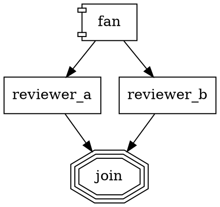

# swarm — conventions for AI agents

> Read this first. If anything here conflicts with the specs, the specs win — update this doc.

## What is this repo

**swarm** is a universal AI agent orchestrator. See `docs/SPEC.md` for what the system is and `docs/PLAN.md` for the incremental build plan. `docs/ARCHITECTURE.md` captures deeper design rationale.

The current phase and its verification bar live in `docs/PLAN.md`. Do not start work outside the current phase without discussion.

## Ground rules

1. **Spec-first.** If you're about to write code that isn't in `docs/SPEC.md` or `docs/PLAN.md`, stop. Either update the spec first or check in with the user.
2. **Tests before declaring done.** No task is complete until the phase's verification bar passes. `bun test` green is table stakes, not success.
3. **No dependencies added silently.** Every new runtime dep goes through `package.json` with an exact version pin and a one-line rationale in the commit message.
4. **Pure core.** `@swarm/core` imports nothing from `node:fs`, `node:child_process`, `node:net`, or anything that touches the outside world. Violation is a build failure.
5. **Events are the source of truth.** Every non-trivial state transition emits a typed event. UI, replay, and cost reports all derive from the event log.

## Stack

- **Runtime:** Bun ≥ 1.2 (primary), Node ≥ 20 (compat fallback)
- **Language:** TypeScript strict (`strict`, `noUncheckedIndexedAccess`, `exactOptionalPropertyTypes`)
- **Schemas:** `@sinclair/typebox`
- **Test runner:** `bun test`
- **Lint / format:** `biome` (single tool, replaces eslint + prettier)
- **Agent runtime:** `@mariozechner/pi-agent-core`
- **LLM client:** `@mariozechner/pi-ai`
- **Logging:** `pino` with `{domain}.{action}_{state}` naming
- **Property-based tests:** `fast-check`

## Commands

```sh
bun install              # install deps
bun run typecheck        # tsc --noEmit across workspace
bun test                 # run all package test suites
bun run lint             # biome check
bun run format           # biome format --write
bun run ci               # typecheck + lint + test (what CI runs)

bun run swarm run <workflow.dot>       # once @swarm/cli exists (Phase 2+)
bun run swarm validate <workflow.dot>
bun run swarm replay <events.jsonl>
```

## Repository layout

```
/Users/bandarra/swarm/
├── docs/                  # SPEC.md, PLAN.md, ARCHITECTURE.md
├── packages/
│   ├── core/              # pure orchestrator (no I/O)
│   ├── agent/             # pi-mono wrapper
│   ├── workspace/         # ExecutionEnvironment adapters
│   ├── events/            # EventSink adapters
│   └── cli/               # single-command entry
├── examples/              # demo workflows
├── workflows/             # swarm's own workflows (self-hosting)
└── .swarm/runs/           # runtime event logs (gitignored)
```

## Reference material (not committed)

Three repos live at the swarm root for research:
- `attractor/` — the NLSpecs we implement (orchestrator, agent loop, LLM client)
- `Archon/` — prior-art YAML-based harness we learn from
- `pi-mono/` — the packages we adopt

If any are missing, re-clone:
```sh
git clone https://github.com/strongdm/attractor.git
git clone https://github.com/coleam00/Archon.git
git clone https://github.com/badlogic/pi-mono.git
```

## Commit conventions

- Commit messages use imperative mood ("add X", not "added X").
- Tag the phase in the subject: `[P1] add edge selection 5-step priority`.
- Every non-trivial change updates a test. If the change is infeasible to test, say so explicitly in the commit body.
- `git commit --no-verify` is banned. Fix the hook, don't skip it.

## Self-hosting

swarm can implement its own new features. To drive a feature change through the harness:

```sh
# Default: Claude Haiku via ANTHROPIC_API_KEY
export ANTHROPIC_API_KEY=sk-...
bun run packages/cli/bin/swarm.ts run workflows/build-feature.dot \
  --input="add a local:list_dir tool that lists files in a directory"

# OpenRouter (one key → 300+ models across every major provider)
export OPENROUTER_API_KEY=sk-or-...
bun run packages/cli/bin/swarm.ts run workflows/build-feature.dot \
  --provider openrouter --model "anthropic/claude-sonnet-4.5" \
  --input="..."

# Any of: openai, google, groq, cerebras, xai, mistral, vercel-ai-gateway,
# github-copilot, amazon-bedrock, google-vertex — see `swarm providers`.

# Replay the run afterwards
bun run packages/cli/bin/swarm.ts replay .swarm/runs/<id>/events.jsonl
```

### Mid-run steering

Send a new user message into a running swarm process:

```sh
bun run packages/cli/bin/swarm.ts steer <run-id> "please also add a test"
```

The message is appended to `.swarm/runs/<run-id>/steering.jsonl`. The running
backend tails the file (≤500ms poll) and injects each line into the active
agent via pi-agent-core's `agent.steer()`. A `steering.injected` event lands
in the run's `events.jsonl` for audit.

### Parallel branches + fan_in

`shape=component` nodes fan out to all outgoing edges as isolated branches
that converge at a `shape=tripleoctagon` node:



Each branch gets a cloned context (writes don't leak to siblings). Branch
context updates merge back via `parallel.branch_results`, `parallel.count`,
and `parallel.successes`. `join_policy="first_success"` returns when the
first branch succeeds.

### Model stylesheet

Assign models/providers by selector instead of repeating per node:

```dot
digraph {
  model_stylesheet = "[shape=box] { model: claude-haiku-4-5 } .heavy { model: claude-opus-4-7; reasoning_effort: high } #explore { model: claude-sonnet-4-7 }"
  ...
}
```

Selectors: `#id`, `.class`, `[shape=X]`, `[attr=value]`. Node-level attrs
always win over the stylesheet.

### Subagent tool

`local:subagent` spawns a focused nested agent (fresh context, its own
tool set, strict timeout, no recursion). Useful for exploration or triage
without polluting the main conversation:

```
local:subagent({
  prompt: "find which files import FooBar",
  timeout_ms: 30000,
  allowed_tools: ["local:grep", "local:read_file"]
})
```

### Worktree isolation

`--worktree` spawns a git worktree under `.swarm/worktrees/<run-id>/` on a
branch named `swarm/<run-id>`. The agent runs entirely inside it; your
working copy and current branch stay untouched. On success, `git checkout
swarm/<run-id>` to review + merge; on failure (or always if you want
post-mortem access) add `--keep-worktree` to preserve the directory + branch
after the run:

```sh
bun run packages/cli/bin/swarm.ts run workflows/add-tool.dot \
  --input="add local:touch tool" \
  --worktree
```

`node_modules` is symlinked from the main repo into the worktree so
`bun test` / `bun run ci` work without a reinstall. Caveat: `bun install`
inside the worktree mutates the shared cache — swarm will still run, but
you may see `bun.lock` changes bleed back to the main repo.

### Multi-provider

swarm is provider-agnostic via [pi-ai](https://github.com/badlogic/pi-mono). Every provider that ships with pi-ai works out of the box — including cross-provider handoffs mid-session (thinking blocks translated, tool-call IDs normalized automatically).

- List all supported providers and which ones have credentials:
  ```sh
  bun run packages/cli/bin/swarm.ts providers
  ```
- Override per-run via `--provider <name> --model <id>`.
- Override per-node inside the workflow: `myNode [provider="openrouter", model="google/gemini-2.5-pro"]`.
- API keys are picked up from standard env vars automatically (`ANTHROPIC_API_KEY`, `OPENAI_API_KEY`, `OPENROUTER_API_KEY`, `GEMINI_API_KEY`, etc.). The CLI refuses to run against a provider whose env var is missing and prints the exact variable name you need.

Related:
- `examples/hello.dot` — tiny smoke workflow (greet + verify)
- `workflows/build-feature.dot` — plan → implement → verify → summarize
- `.swarm/config.yaml` — per-project defaults + workflow shortcuts

The agent writing code on swarm's behalf has full access to `local:read_file`, `local:write_file`, and `local:bash`. The command blocklist in `.swarm/config.yaml` refuses the most dangerous patterns even in unsafe mode. Everything emitted to `.swarm/runs/<id>/events.jsonl` is an immutable audit trail.
