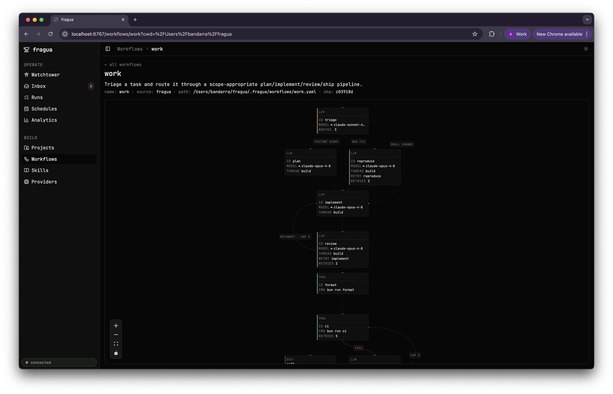
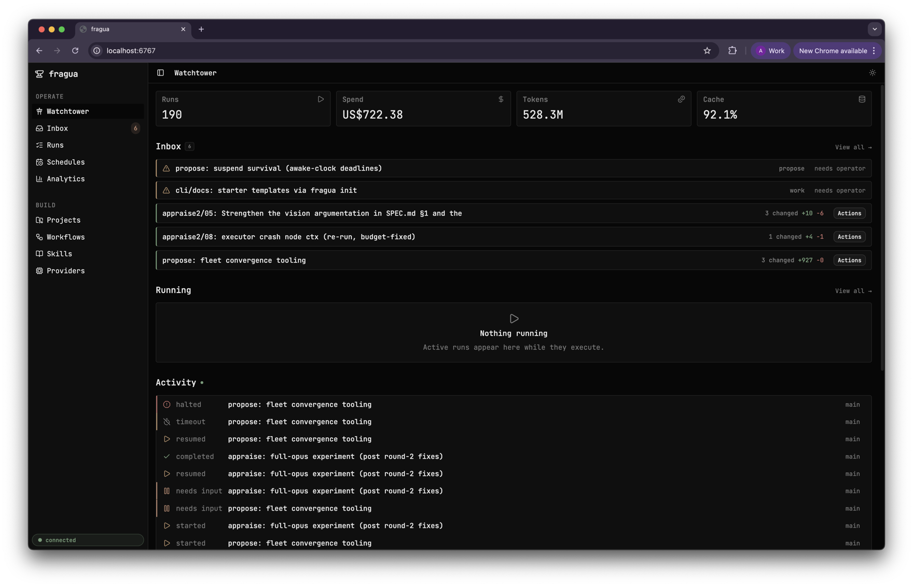
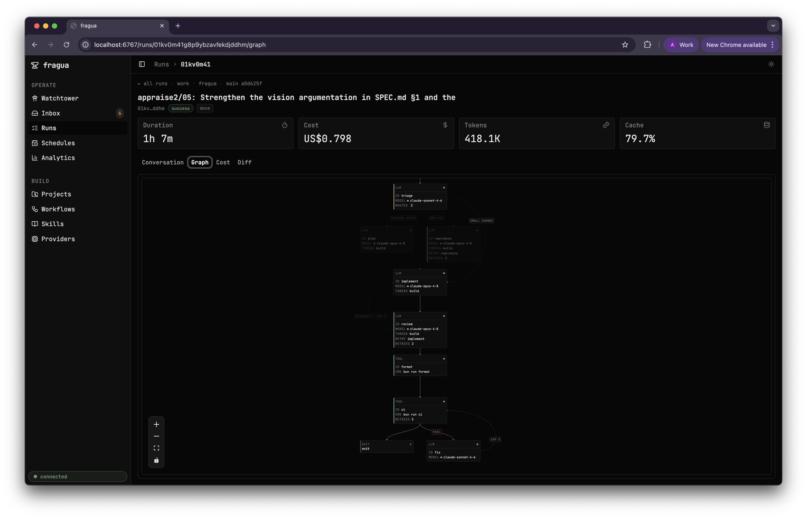
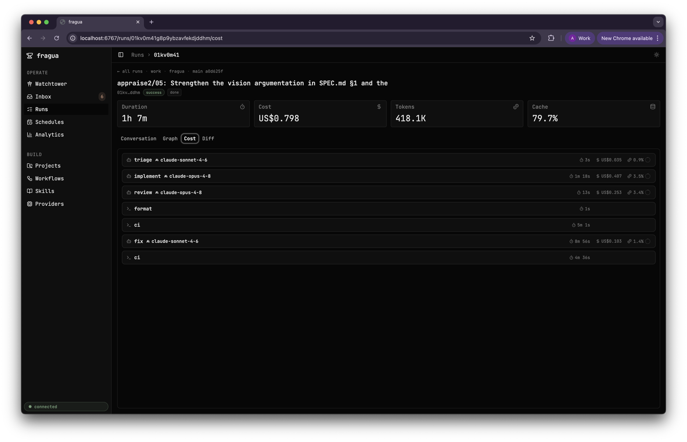
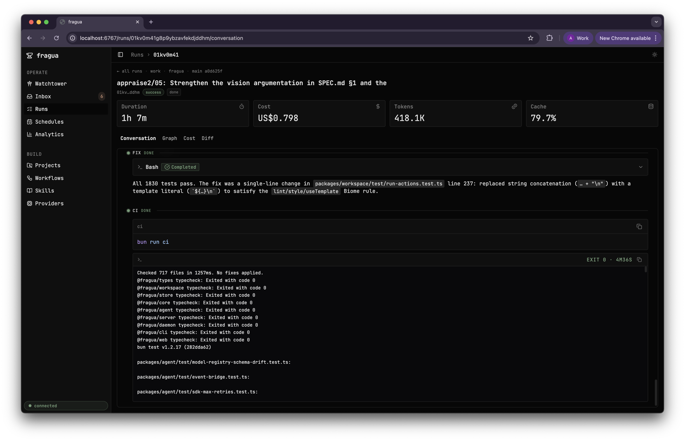
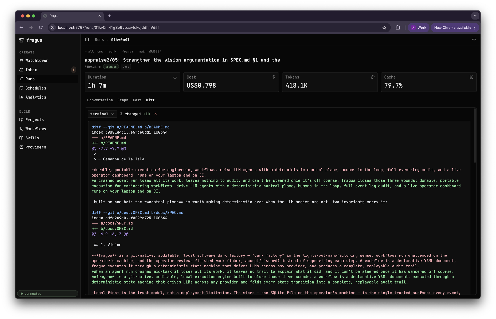
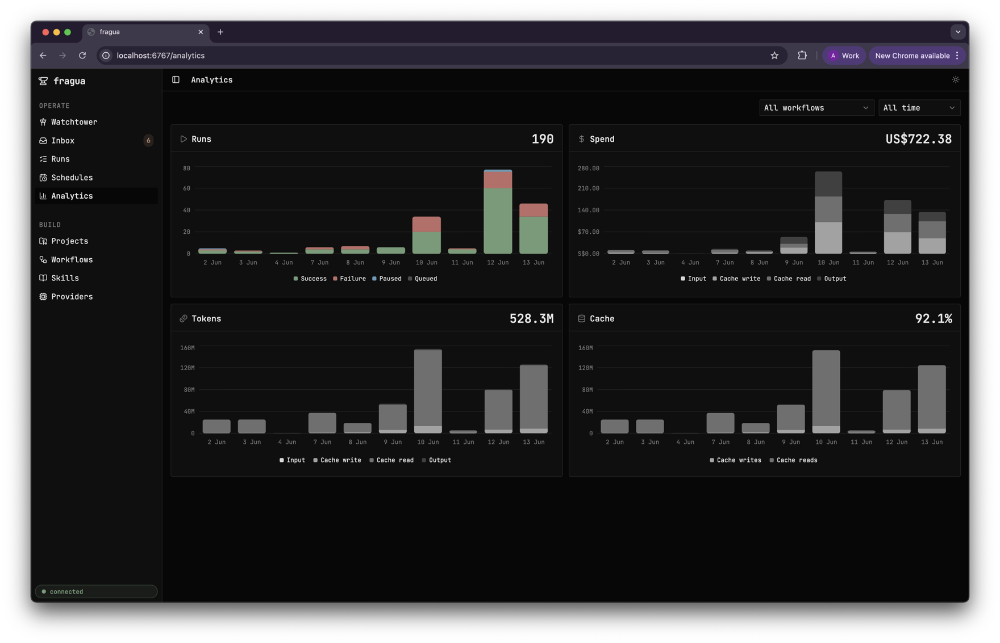

# fragua

> Cuando los niños en la escuela \
> estudiaban pa' el mañana, \
> mi niñez era la fragua: \
> yunque, clavo y alcayata.
>
> — Camarón de la Isla

*fragua — Spanish for forge.*

[](https://github.com/purrgrammer/fragua/actions/workflows/ci.yml)
[](https://github.com/purrgrammer/fragua/releases/latest)
[](LICENSE)

**Durable AI workflows for engineering.** Wire LLM agents into a YAML state machine; fragua runs it deterministically — survives crashes and provider outages, lets you steer a live run mid-flight, and records every run as a replayable artifact. On your laptop and in CI.

A workflow is a small state machine in plain text:

```yaml
# review.yaml — scope a diff, review it, gate the result before it lands
name: review
inputs:
  target: { type: string, required: true }
steps:
  review:
    type: llm
    allowed-tools: [read, grep, bash, write]
    prompt: |
      Review the diff in ${{ inputs.target }}. Flag bugs, security,
      scope creep. Write the verdict to review.md.
    next: signoff
  signoff:
    type: human                       # pauses for an operator decision
    text: "Post this review?"
    routes: { approve: exit, revise: review }   # "revise" loops back — a redo gate
```

```sh
fragua run review --input target="HEAD~1..HEAD"
```

The engine compiles that into a graph and drives it — here's a richer one (`work`) rendered in the UI:





> Pre-1.0 and actively developed — some surfaces still move fast, but backwards compatibility is honored. [STATUS.md](STATUS.md) tracks what's stable and what's still settling.

## What You'd Build

- **Review every diff or PR** — flag bugs/security/scope-creep, gate the post behind a human (`review`, `pr_review`).
- **A coding agent with guardrails** — triage → plan or write-the-failing-test-first → implement → review → CI, change left in a worktree to accept (`work`).
- **Repo health on a schedule** — bump deps keeping CI green (`dependencies`), audit docs against code (`drift`), roll up cost/latency analytics (`analyze`).
- **A fleet that improves itself** — workflows that draft proposals through an adversarial panel (`propose`), dispatched and met in an inbox.

Each is a YAML file you can diff, version, and code-review. Nothing in the engine is code-specific — worktrees and CI are just one environment adapter.

## What You Get

- **Workflows are text.** Plain YAML — diff, version, code-review. No DSL.
- **Survives crashes & provider hiccups.** Transient errors auto-retry; recoverable failures (budget, loop/goal caps, timeouts) pause instead of dying — raise the cap, resume. A daemon restart picks up mid-flight runs.
- **Any provider.** Per-step `provider` / `model`, pre-flighted against pi-ai's registry — bad combos fail in milliseconds, not after 30 retries.
- **Steer a live run.** Pause, steer, resume, raise a budget mid-flight — the handler unwinds losslessly, the next dispatch sees your input, the run never dies.
- **An operator surface.** Live web UI on `:6767`: SSE, run-scoped file tree + git diff, transcripts, cost panels, steering + HITL.
- **Fan out when it pays.** A `parallel` step forks read-only branches that converge on one join; typed `outputs:` carry each result forward.
- **Schedules built in.** Fixed-interval fires (`30m`…`7d`) with overlap policy and late-fire catch-up.
- **A run is a portable artifact.** Event log, messages, workflow IR, and a git-bundle of snapshots — self-contained, secret-free. Replay it on another machine.

## Operator UI

A live dashboard on `:6767`. Every run is inspectable down to its topology, per-step cost, transcript, and git diff — all over SSE, daemon up or down.

<table>
<tr>
<td width="50%"><br/><sub>Topology — the run as a graph</sub></td>
<td width="50%"><br/><sub>Per-step cost, model, and cache</sub></td>
</tr>
<tr>
<td width="50%"><br/><sub>The full transcript, step by step</sub></td>
<td width="50%"><br/><sub>Git-aware diff of the worktree</sub></td>
</tr>
<tr>
<td colspan="2"><br/><sub>Spend, tokens, and cache across runs</sub></td>
</tr>
</table>

## Why It Holds Up

One bet: the **control plane** is worth making deterministic even when the LLM bodies are not.

- **Durable writes linearize through one committer.** Fan-out branches execute *concurrently* but commit *serially* — one monotonic order over every fact, so a recorded run replays by folding the log, not re-running the model. Durability is turn-grained: a recorded turn never re-runs; an in-flight call re-executes on resume.
- **Operator actions are intents.** Pause, steer, resume, budget raises — always-appendable, conflict-free writes the executor folds into the next dispatch. That's what makes mid-flight steering possible.

> Parallel branches must be read-only `llm` steps — no `bash`/`write`/`edit` (the validator rejects a writing branch, E042). All durable commits serialize through the run's single committer.

## Prerequisites

- **git** (required) — every run executes in an isolated worktree; diff / accept / discard are git operations.
- **A provider API key** — Anthropic, OpenAI, or any [pi-ai](https://github.com/badlogic/pi-mono/tree/main/packages/ai) provider. `fragua providers add` stores it.
- **Bun ≥ 1.2** — only to build from source; release binaries are self-contained.
- **[`gh`](https://cli.github.com/)** (optional) — only for PR-number targets (`target="PR <n>"`).
- **Windows** — no native build; run under WSL2.

## Install

**Release binary** — self-contained builds for linux & macOS (x64/arm64), each in a full flavor (web UI embedded) and a headless one (what CI installs). `SHA256SUMS` + Sigstore attestations cover every asset.

```sh
asset="fragua-bun-$(uname -s | tr '[:upper:]' '[:lower:]')-$(uname -m | sed -e 's/x86_64/x64/' -e 's/aarch64/arm64/')"

# Direct HTTPS (curl) — no extra tooling beyond curl:
curl -fL -o fragua "https://github.com/purrgrammer/fragua/releases/latest/download/$asset"

# …or with the GitHub CLI, if you have it:
gh release download --repo purrgrammer/fragua --pattern "$asset" --output fragua

chmod +x fragua && mv fragua ~/.local/bin/   # anywhere on PATH
fragua --version
```

**From source** — a first-class path, not contributor-only. Needs Bun ≥ 1.2 and a clone:

```sh
bun install && bun run build:bin     # compiles dist/fragua (web UI embedded)
export PATH="$PWD/dist:$PATH"
```

> Hacking on fragua itself? Skip the build — `bun run fragua <args…>` hits the same entry point.

**Upgrading** — an installed binary self-updates from GitHub Releases:

```sh
fragua upgrade                  # install the latest published release
fragua upgrade --to v0.9.0      # install a specific tag (0.9.0 or v0.9.0)
```

It downloads over plain HTTPS (the release repo is public — no `gh` CLI, no auth) and verifies the download against `SHA256SUMS` before swapping the binary in place. A `version:` pin in `~/.fragua/config.yaml` freezes the install — `fragua upgrade` then refuses unless you pass `--to`.

## Quickstart

```sh
fragua providers add            # pick any provider, paste a key
fragua harness                  # daemon + web UI on :6767 (Ctrl-C to stop)

cd ~/code/your-project
fragua init                     # writes .fragua/config.yaml + .fragua/workflows/
curl -fsSL -o .fragua/workflows/hello-world.yaml \
  https://raw.githubusercontent.com/purrgrammer/fragua/main/.fragua/workflows/hello-world.yaml
fragua run hello-world --input name="Ada"
```

Output lands in the run's own worktree at `.fragua/worktrees/<run_id>/` under the run cwd — your project stays untouched until you accept. Watch it live in the web UI at **http://localhost:6767**, or inspect from the terminal with `fragua runs status <id>`. Finished runs queue in the inbox (`fragua runs inbox`) where you `fragua runs accept <id>` to merge the worktree back or `fragua runs discard <id>` to drop it. See **[docs/execution-model.md](docs/execution-model.md)** for the full filesystem layout and accept/discard lifecycle.

`hello-world` pins no provider, so it runs on whatever key you added. To pin one for every provider-neutral workflow without touching any YAML, set `defaults:` in `~/.fragua/config.yaml`:

```yaml
defaults: { provider: openai, model: gpt-5 }
```

`fragua run` works from any directory against the global DB. A name resolves under `~/.fragua/workflows/` then `<cwd>/.fragua/workflows/`; `-i name=value` binds typed inputs (`@path`/`@-` read a file/stdin). Driving, steering, and landing runs is the **operate** skill; HITL and forensics live there too.

## CI

```yaml
- uses: purrgrammer/fragua/.github/actions/setup-fragua@v0.7.0
```

**[docs/CI.md](docs/CI.md)** covers setup, credentials, passing secrets to tool steps (`--allow-env`), and run bundles.

## Workflows

Ships under `.fragua/workflows/`. `hello-world`, `review`, and `pr_review` are **portable starters** (any repo; `gh` only for PR-number targets); the rest are wired to fragua's own scripts and docs — run them here, or read them as authoring references. Each `budget:` is a run-level hard cap, not the typical cost.

| workflow | what it does | portability | spend |
|---|---|---|---|
| `hello-world` | greet + write `hello.txt` — the smoke test | portable, pins no provider | `1.00` cap |
| `review` | scope a PR / diff → structured review, gated apply tail | portable (PR targets need `gh`) | `12.00` cap |
| `pr_review` | unattended CI review — posts the verdict to the PR | portable (needs `gh` + `GH_TOKEN`) | `21.00` cap |
| `work` | triage → (plan / reproduce) → implement → review → CI | fragua-internal | **set one**; frontier model |
| `analyze` | cost / token / latency analytics over recorded runs | fragua-internal | `5.00` cap |
| `dependencies` | bump dep pins, keep typecheck + CI green | fragua-internal | `6.00` cap |
| `drift` | audit arch / spec / skill docs against the code | fragua-internal | `10.00` cap, stops |
| `propose` | draft a proposal through a five-lens adversarial panel | fragua-internal | `40.00` cap |

Author your own; `fragua validate <file>` parses + lints before you run.

## Skills

Domain context loaded on demand by the agents a workflow runs (under `.agents/skills/`).

| skill | loaded when you're… |
|---|---|
| `workflows` | authoring or editing a workflow YAML |
| `operate` | driving or debugging a run — enqueue, tail, steer, HITL, land, forensics |
| `backend` | touching `packages/{server,store,core,agent}` |
| `frontend` | touching the React dashboard (`packages/web/src`) |
| `design` | touching styles, theme tokens, or layout |

## Commands

```sh
fragua providers add            # add a provider credential
fragua harness                  # daemon + HTTP on :6767

fragua run <workflow> -i task="…"   # save + enqueue + follow (--no-follow to detach)
fragua runs inbox                   # runs needing an operator decision
fragua runs status <id>             # lifecycle + outcome + the why
fragua runs respond <id> [route]    # answer a HITL gate
fragua runs accept  <id>            # land a finished run's commits onto your branch

fragua ci <workflow>            # one-shot for CI: exit code = outcome
fragua schedule add <wf> --every 1h
fragua validate <workflow.yaml>
```

The CLI is a direct store-client — these work from any directory, daemon up or down. Full verb/flag/exit-code reference: **[docs/cli.md](docs/cli.md)**.

## Docs

- **[STATUS.md](STATUS.md)** — what's working today
- **[docs/cli.md](docs/cli.md)** — CLI reference + exit codes
- **[docs/CI.md](docs/CI.md)** — running fragua in CI
- **[docs/SPEC.md](docs/SPEC.md)** — what fragua is
- **[docs/ARCHITECTURE.md](docs/ARCHITECTURE.md)** — schema, invariants, property matrix
- **[docs/handler-contract.md](docs/handler-contract.md)** — writing handlers
- **[docs/providers.md](docs/providers.md)** — providers + credentials
- **[AGENTS.md](AGENTS.md)** — conventions for agents (and humans)

## Stack

Bun ≥ 1.2 · TypeScript strict · SQLite (WAL + STRICT) · Hono · React 18 + Vite 5 + Tailwind 4. LLM layer is [`pi-ai`](https://github.com/badlogic/pi-mono/tree/main/packages/ai) (15+ providers) + [`pi-agent-core`](https://github.com/badlogic/pi-mono/tree/main/packages/agent); store, daemon, server, and handler contract are fragua's own.

## License

MIT.
