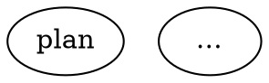

# Events, fidelity, summariser, budgets

## Per-step agent context (introspection)

Every `llm.start` event on the SSE stream carries the full resolved context for one agent step so the UI / replay layer never has to reconstruct state out of band. Authoritative per-step fields (see `docs/SPEC.md §3.5`):

- `prompt`, `system_prompt`, `provider`, `model`
- `thread_id`, `allowed_tools`, `denied_tools`
- `iteration: { n, max }` on every loop-originated call
- `messages`: prior turns visible to the agent when a shared `thread_id` restored a pi-agent-core session (omitted on fresh sessions)
- `settings`: resolved generation knobs (`temperature`, `max_tokens`, `top_p`, `reasoning_effort`, `stop`)
- `context_files`: `[{ path, sha256, bytes, truncated, status }]` — use the sha256 to detect drift between a run and a later replay
- `budget`: read-only snapshot (`cumulative_cost_usd`, `cumulative_tokens`, `max_cost_usd?`, `run_max_cost_usd?`); emitted only when a ceiling is configured until Wave 4 wires real counters

The envelope carries `schema_version` (current: `1`). Pre-versioned JSONL omits the field; validators must treat `undefined` as `1`. Use `validateEvent(raw, { checkPayload })` from `@swarm/events` to check event shapes at boundaries (replay harnesses, ingestion).

## Fidelity modes

swarm owns a per-backend `MessageStore` keyed by `thread_id` (`packages/agent/src/message-store.ts`). pi-agent-core's `sessionId` is only a provider-cache hint — the store is what makes `fidelity=full` restore prior turns across nodes.

| Mode | Prior turns restored | Seed prepended to user prompt | sessionId bucket |
|---|---|---|---|
| `full` | yes (from store) | none | `thread_id` |
| `truncate` | no | goal + run_id only | `thread_id:truncate` |
| `compact` | no | digest (role census + latest assistant text, ≤1.5 KB) | `thread_id:compact` |
| `summary:low` | no | deterministic template (≤600 char tail) | `thread_id:summary:low` |
| `summary:medium` | no | same as `summary:low` + `agent.warning` | `thread_id:summary:medium` |
| `summary:high` | no | same as `summary:low` + `agent.warning` | `thread_id:summary:high` |

Resolution chain: edge attr → target node attr → `graph.default_fidelity` → hard default `compact`.

Node-level overrides that ride on top of fidelity:

- `context = "fresh"` — hard opt-out. Ignores store, doesn't persist, omits `sessionId` entirely. Useful for one-off diagnostic nodes that must not see the rest of the run.
- `system_prompt = "…"` — per-node system-prompt override (e.g. a reviewer / planner persona). Context-files block is still prepended.

Goal-gate retry is **two-phase**: `retry_target` spends up to `max_goal_gate_retries`, then — if a *distinct* `fallback_retry_target` is set — the budget resets and the fallback gets its own round. When `retry_target` is unset but `fallback_retry_target` is, it's used as the primary (single phase).

## Summariser + auto-title

A cheap-model summariser (separate from the coder model) powers two adjacent features:

1. **Pipeline auto-title** — `execute()` fires a fire-and-forget summariser call over `$ARGUMENTS` at pipeline start. When the call returns, `pipeline.title_generated` is emitted (synthetic `node_id = __summary.title`) and the title is mirrored into `context["graph.title"]` so prompts can substitute it. UIs fall back to `input` (raw `$ARGUMENTS`) then `workflowName`. Disable with graph attr `auto_title = "off"` or CLI flag `--no-auto-title`.
2. **Fidelity `summary:medium` / `summary:high`** — the same summariser compresses prior transcript for these modes. Synthetic `node_id` is `__summary.<caller>` (+ `#<iter>` in loops). On failure it falls back to the deterministic `summary:low` template with a warning.

Each summariser call emits `summary.started` + `summary.completed` + its own `cost.recorded` under the synthetic `node_id`, so cost totals are correct without any bespoke aggregation. Drilldown surfaces can render each synthetic node as a lightweight step in the timeline.

Configure in `.swarm/config.yaml`:

```yaml
defaults:
  summariser:
    provider: openrouter
    model: anthropic/claude-haiku-4.5
auto_title: on
```

CLI flags: `--summariser-provider <name>`, `--summariser-model <id>`, `--no-auto-title`. Flags win over config.

Retrofit titles onto pre-Wave-2b runs with `bun run scripts/backfill-titles.ts [--dry-run]`. Idempotent (skips runs that already carry `pipeline.title_generated`) and append-only.

## Budgets

Cost + token ceilings are enforceable at node and run scope:



The `BudgetLedger` in `@swarm/core/engine/budget.ts` is a pure reducer over `cost.recorded` events. When the cumulative crosses 80 % of any ceiling, `budget.warn` fires once; at 100 %, `budget.stop` fires once and — under `stop` policy — the next codergen call fails non-retryably (so goal-gate retries don't relaunch the breach). Both events ride under the synthetic `__budget` node so drilldown surfaces render them alongside summariser events.

`llm.start.budget` carries the real cumulative snapshot (`cumulative_cost_usd`, `cumulative_tokens`, plus the ceilings) as soon as *any* budget knob is declared. Synthetic `__summary.*` summariser calls contribute to the run-level total but do NOT count against the caller node's `max_cost_usd` — a tight per-node cap can still trigger richer fidelity compressions.
