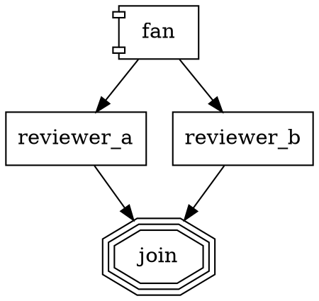

# Workflow features: parallel branches, stylesheets, subagents

## Parallel branches + fan_in

`shape=component` nodes fan out to all outgoing edges as isolated branches that converge at a `shape=tripleoctagon` node:



Each branch gets a cloned context (writes don't leak to siblings). Branch context updates merge back via `parallel.branch_results`, `parallel.count`, and `parallel.successes`. `join_policy="first_success"` returns when the first branch succeeds.

## Model stylesheet

Assign models/providers by selector instead of repeating per node:

```dot
digraph {
  model_stylesheet = "[shape=box] { model: claude-haiku-4-5 } .heavy { model: claude-opus-4-7; reasoning_effort: high } #explore { model: claude-sonnet-4-6 }"
  ...
}
```

Selectors: `#id`, `.class`, `[shape=X]`, `[attr=value]`. Node-level attrs always win over the stylesheet.

## Subagent tool

`local:subagent` spawns a focused nested agent (fresh context, its own tool set, strict timeout, no recursion). Useful for exploration or triage without polluting the main conversation:

```
local:subagent({
  prompt: "find which files import FooBar",
  timeout_ms: 30000,
  allowed_tools: ["local:grep", "local:read_file"],
  preload_skills: ["code-search"]   // optional: pre-activate named skills
})
```

The child re-runs skill discovery so its tier-1 catalog matches the parent's, but activated SKILL.md bodies do NOT propagate unless listed in `preload_skills`. Fresh-context invariant wins.
